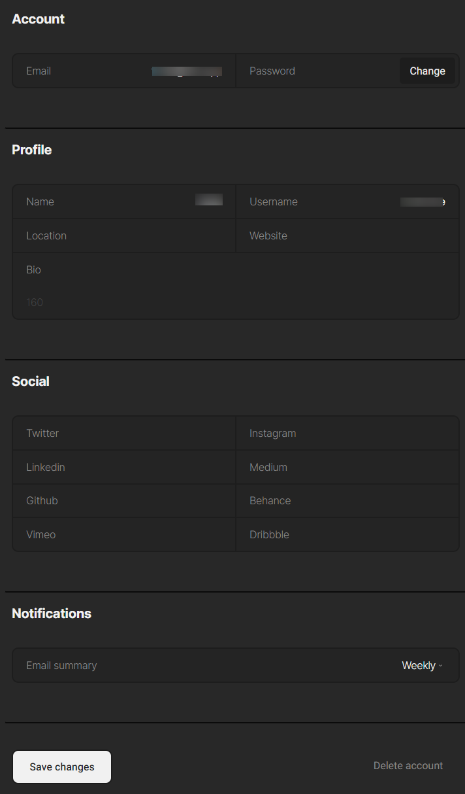
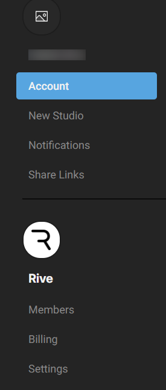
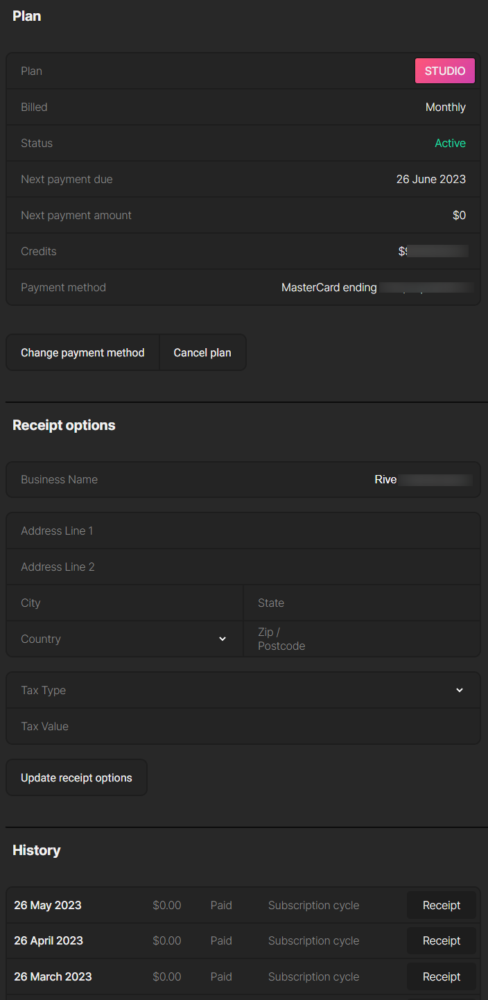
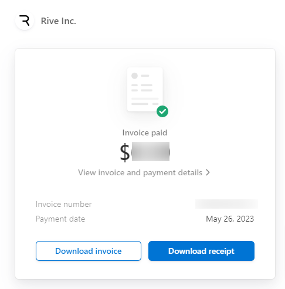

# Account settings

On the [Rive website](https://rive.app/), in the upper right is a button that says "Get Started."\

<figure><figcaption></figcaption></figure>

Click on the "Get Started" button to launch the Rive web application. Note: If you aren't logged in, it will prompt you to log in.&#x20;

At the top of the page is your name and the word drafts. Click on the drop-down arrow, then click on Settings. This opens your [account information](https://rive.app/account/?section=account) in a new tab.\

<figure><figcaption></figcaption></figure>

\
On the new page, you are viewing your account information.&#x20;

<figure><figcaption></figcaption></figure>

**Account**: This section shows your account's email address and password. To change your email address, click the field and type in a new one. Scroll down to the bottom of the page and click on the "Save changes" button.&#x20;

To change your password, click the field and type in the new password. Scroll down to the bottom of the page and click on the "Save changes" button.

**Profile**: This section shows your name, username, location, website, and bio. Only your name and username are required. To change or add information, click the field and type in the new information. Scroll down to the bottom of the page and click on the "Save changes" button.&#x20;

**Social**: You can link to any of the social media accounts listed. Once you've added that information, scroll down to the bottom of the page and click on the "Save changes" button.&#x20;

**Notifications**: This is where you select how often you want to be notified of any changes we send out via email. You can also unsubscribe from notifications.&#x20;

**Save changes**: This button saves any changes you make to your account.

**Delete Account**: This button is where you can delete your account. You cannot delete your account if you have an active paid team. You must cancel your team before you can delete your account.&#x20;

The names of the teams you are part of are down the left side of the page. Under the team's name (In this example, the team name is Rive) are the words Members, Billing, and Settings.&#x20;

<figure><figcaption></figcaption></figure>

**Members**: If you are part of a paid team, you can view your team members here.

**Billing**: Billing takes you to your billing page.&#x20;

**Settings**: These are the settings for your team.&#x20;

You will see Plan, Receipt options, and History on the billing page.&#x20;

<figure><figcaption></figcaption></figure>

**Plan**: This is the information for your account. It tells you the billing term (monthly or yearly) and if the team is active or suspended. Your due date is there and the amount of your next bill. Your credit balance is listed along with your payment method. This is where you can change your payment method or cancel your plan.&#x20;

**Receipt options**: You can enter in the information you want on your receipt in this section. If you have a VAT number, you can add it in here. Our current system does not show the VAT number on your receipt. If you need your receipt to show that information, please email us at support@rive.app and we can generate the receipts for you.&#x20;

**History**: Your billing history is in this section. You can see each bill, what you paid, and there is an option to click on Receipt. This will take you to a page showing the receipt you received. From there, you can download a .pdf copy of the receipt or the invoice, depending on your need. \

<figure><figcaption></figcaption></figure>
