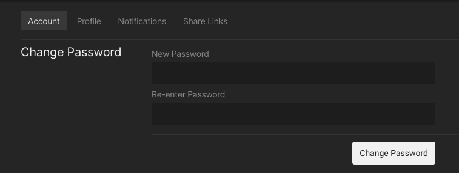
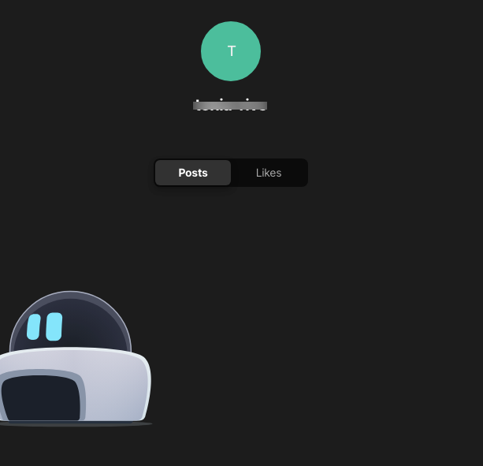
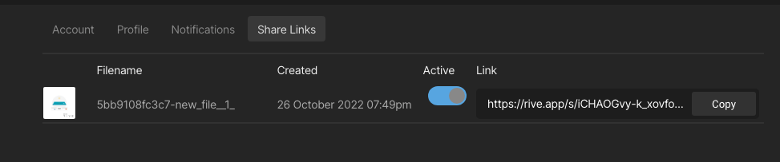
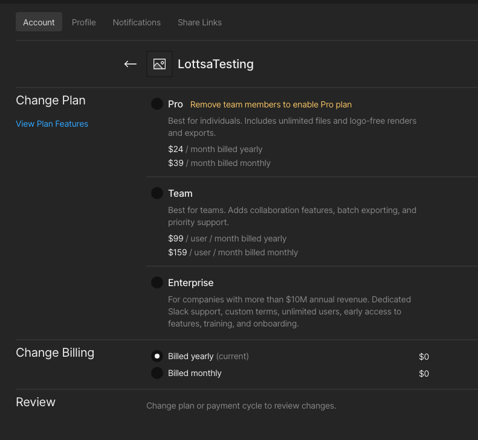

# Account Management

On the [Rive website](https://rive.app/), in the upper right is a button that says "Get Started."\

<figure><figcaption></figcaption></figure>

Click on the "Get Started" button to launch the Rive web application. Note: If you aren't logged in, it will prompt you to log in.&#x20;

At the top of the page is your name and the word drafts. Click on the drop-down arrow, then click on Settings. This opens your [account information](https://rive.app/account/?section=account) in a new tab.\

<figure><figcaption></figcaption></figure>

\
On the new page, you are viewing your account information.&#x20;

<figure><figcaption></figcaption></figure>

There are 4 tabs across the top.&#x20;

#### **Account**: This is the default tab that is selected. This section shows:

* The email address associated with your account
* Username
* Display Name
* Location
* Bio
* Website

To change your email address and/or profile information, click on "Edit Profile" on the right. Type in the new information you wish to update and click on "Save changes" at the bottom.

<figure><figcaption></figcaption></figure>

To change your password, click on Change Password and type in the new password. Click on "Change Password" to save the change.

<figure><figcaption></figcaption></figure>

#### **Profile**:&#x20;

This section shows your name, username, location, website, and bio. Only your name and username are required. To change your email address and/or profile information, click the Account link in the above tab. Then, click on "Edit Profile" on the right. Type in the new information you wish to update and click "Save changes" at the bottom.

<figure><figcaption></figcaption></figure>

**Notifications**: This is where any notifications you have will appear.

#### **Share links**:&#x20;

This tab shows you any share links you have generated. You can see the file you shared, the date when the share link was created, if the share link is active, and the link to the file. By toggling the Active button off, the link becomes inactive. You can also copy the link and share it as long as it's active.

<figure><figcaption></figcaption></figure>

#### **Your Plans**:&#x20;

Along the left side of the page is a list of the plans you have. You can have multiple plans and you can be a member and/or owner of multiple teams.&#x20;

<figure><figcaption></figcaption></figure>

Each team has a name and under the name is the status of the team.

* Active: The team is active and paid.
* Active (ends on a specific date): This team is set to cancel at the end of the billing cycle.&#x20;
* Suspended: The team is canceled.
* Failed Payment: The payment failed.

To manage the team, click on "Manage Team" to the right.&#x20;

<figure><figcaption></figcaption></figure>

The team name is at the top. You can upload an avatar for the team. "Upload Avatar" opens a window where you can select a file on your computer to use as your avatar.&#x20;

#### **Plan:**&#x20;

This tells you the name of the plan the team is on and the status of the team.&#x20;

* To change the plan, click on "Change Plan".
* You can select a new plan and the payment cycle you would prefer.&#x20;
* Note: The Pro plan is a single-person plan. If the team has multiple people, you cannot create a Pro plan.&#x20;

<figure><figcaption></figcaption></figure>

* To cancel the plan, click on "Cancel Plan".
* You will be directed to a Stripe page. From there, you click on the "Cancel plan" button.&#x20;

<figure><figcaption></figcaption></figure>

**Profile:** This shows the information about the team. You can update this by clicking "Edit Profile".

**Manage Billing**: This link takes you to a Stripe page. You can update your billing information via Stripe. You can change your payment method and add a VAT number if required.&#x20;

**Members**: If you are part of a paid team, you can view your team members here. You will see who is the team owner (yourself) and any other team members will be listed. Clicking on "Invite Members" will allow you to type in an email address. Once you hit enter, the email address is shown below and you can click on the box to make that person an admin. You will be given information on what adding that person will cost and what your next billing will be. They are not invited to the team until you click on the "Confirm & Pay" button. Once you confirm the change, an invite to the team will be emailed out and you will be charged for adding the new person to your team.&#x20;

<figure><figcaption></figcaption></figure>

**Billing History**: Your billing history is available on the Stripe page. You can access this by clicking on "Manage Billing". The Stripe page will open. If you aren't already logged in, you will need to enter the email address associated with your Rive account. Stripe will email you a login link. Check your spam folder if the email hasn't arrived within a couple of minutes. At the bottom, you can download your previous invoices. \

<figure><figcaption></figcaption></figure>
