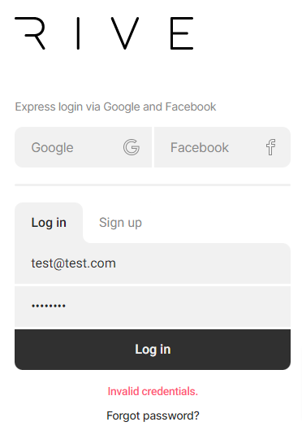

# Trouble Logging In

If you type in your email address and password and see "Invalid credentials," you could have typed in the wrong login information or created your account using express login via Google or Facebook.&#x20;

If you used express login, we do not have a password stored in our system - that's managed by Google or Facebook. You must use the Google or Facebook sign-in option, not email and password.

The email and password option to log in is for creating your account using an email and a password. When you've forgotten your password, you can click on "Forgot password?" under the Log in button, and you will be sent an email to reset your password.&#x20;

For additional help, please email us at support@rive.app.

<figure><figcaption></figcaption></figure>
