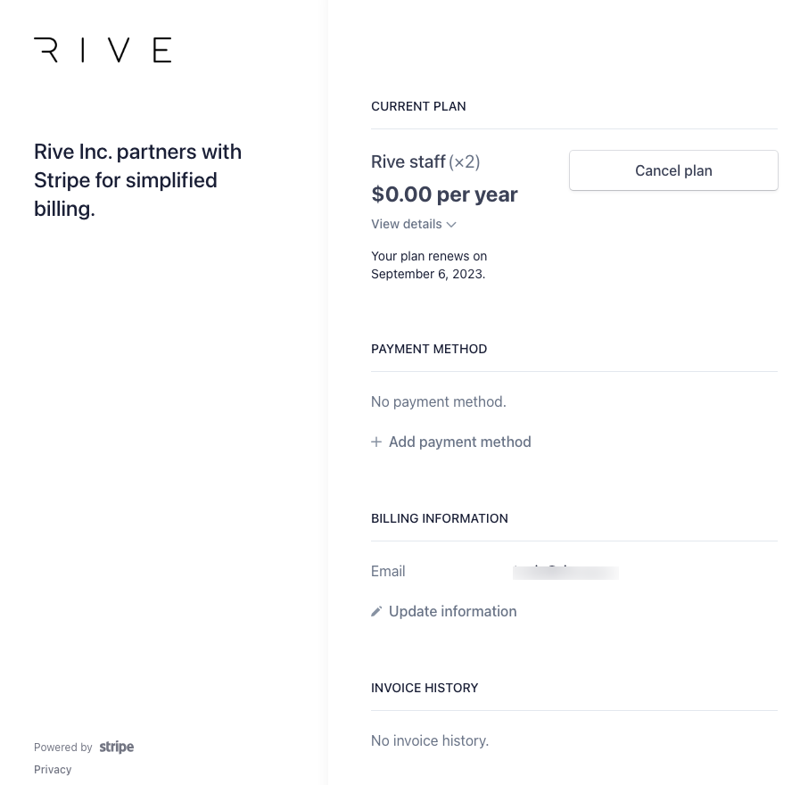

# Cancel my account

You must log in to your account and access your account admin page: [rive.app/account](https://rive.app/account/)

<figure><figcaption></figcaption></figure>

Under the section "Your Plans" is a list of your paid teams. You can have and be a member of multiple teams. Under the team name is the status of the team. If you have an active paid team and wish to cancel, click "Manage Team" on the right.&#x20;

<figure><figcaption></figcaption></figure>

On the Team management page, you can see the team name and plan you are paying for. To the right, click on "Cancel Plan." You will be directed to a secure Stripe page where you can cancel your plan.&#x20;

<figure><figcaption></figcaption></figure>

Click on "Cancel Plan," and you will receive a confirmation of the cancellation.&#x20;
