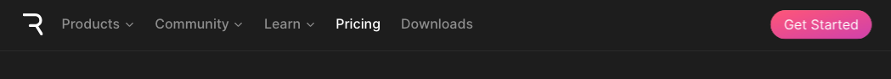
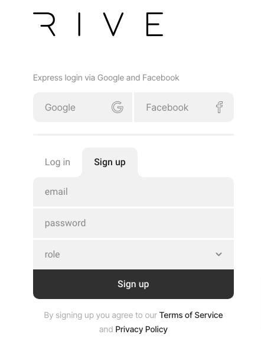
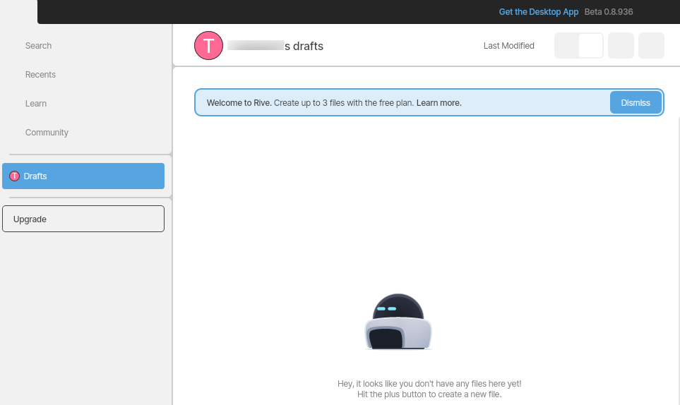

# Creating an Account

To create an account with Rive, you will need to go to our website: [https://rive.app/](https://rive.app/)

In the upper right corner is a "Get Started" button.&#x20;

<figure><figcaption></figcaption></figure>

Click on the button to be directed to the sign-in/sign-up page.&#x20;

<figure><figcaption></figcaption></figure>

Enter your email address, a secure password, and answer the "role" question. Click "Sign up."

You have created a free account.&#x20;

<figure><figcaption></figcaption></figure>

If you wish to subscribe to a paid plan, click on "Upgrade" on the left side of the editor.&#x20;

Go [here](how-to-subscribe-to-a-paid-plan.md) for help subscribing to a paid plan.
