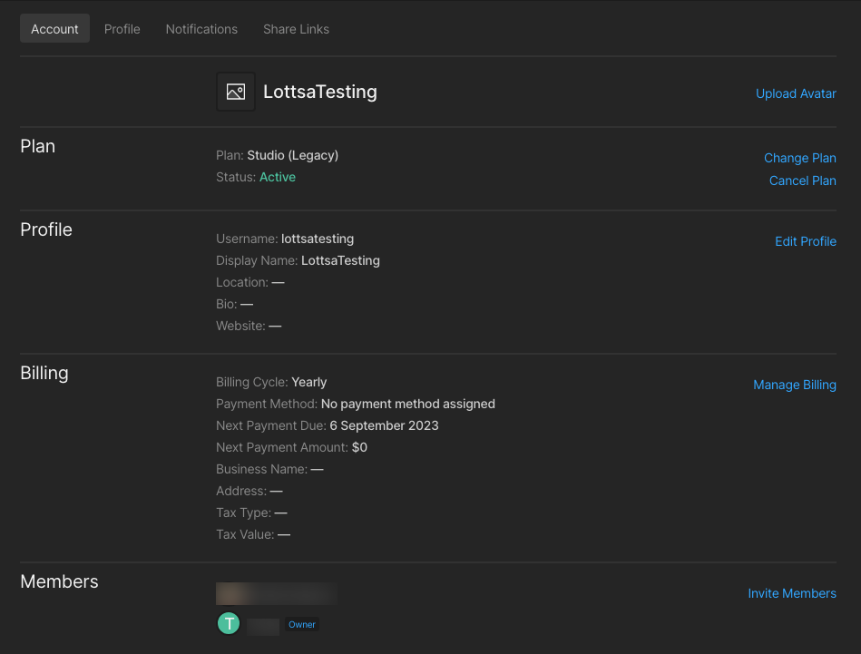
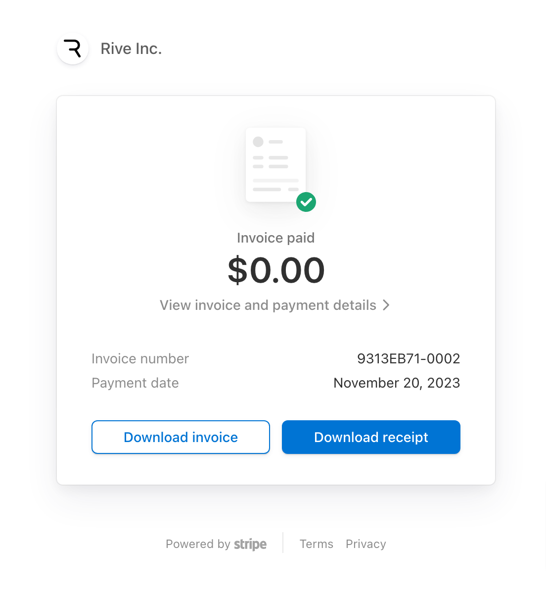

# Downloading My Receipt/Invoice

You must log in to your account and access your account admin page: [rive.app/account](https://rive.app/account/)

<figure><figcaption></figcaption></figure>

Under "Your Plans" are the list of teams you are part of. Locate the team you wish to download the receipt for and click on "Manage Plan."

<figure><figcaption></figcaption></figure>

On the team management page, scroll down to "Billing."&#x20;

Click on the "Manage Billing" link on the right.&#x20;

You will be directed to a secure Stripe page. At the bottom of the Stripe page is your Invoice History for this team. Clicking on the date for each invoice will open the invoice for you in a different window. You can then download a PDF version of your receipt and/or your invoice.&#x20;

<figure><figcaption></figcaption></figure>
