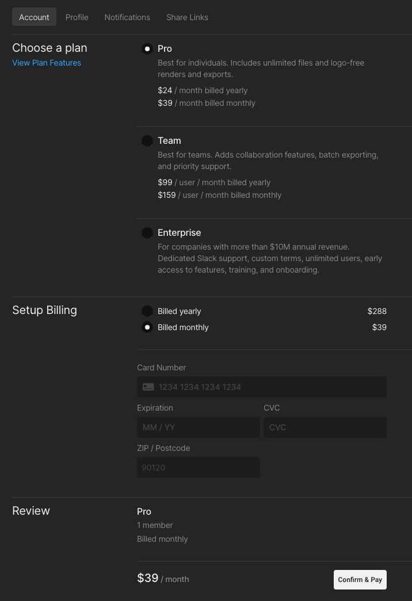
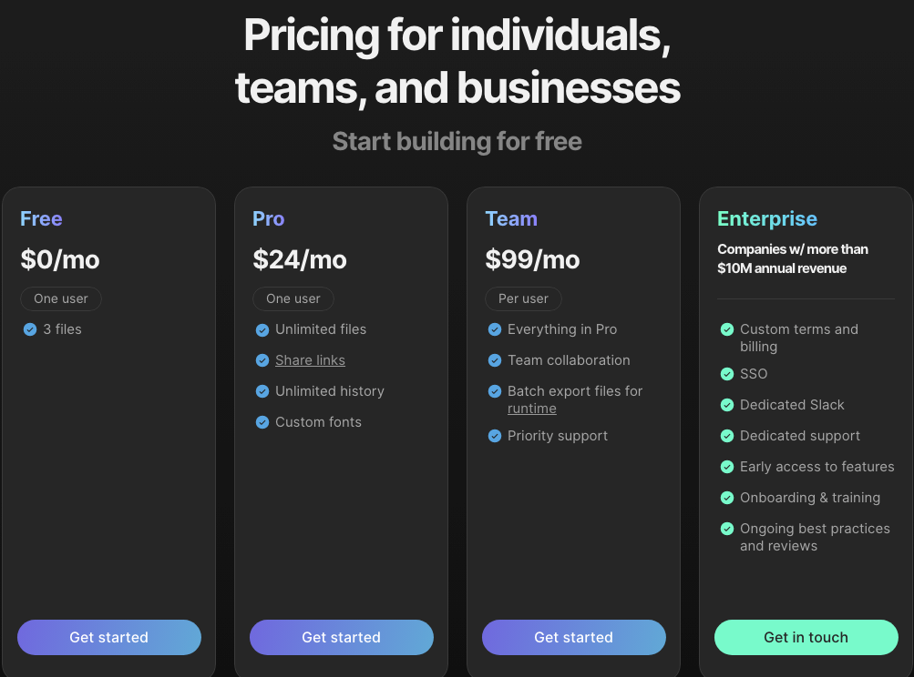

# How to Subscribe to a Paid Plan

If you currently have a free account with Rive and wish to subscribe to a paid plan, you must log in to your account.&#x20;

The editor has an "Upgrade" button in the left menu.&#x20;

<figure><figcaption></figcaption></figure>

Clicking on "Upgrade" will take you to the [subscription page](https://rive.app/account/upgrade/).&#x20;

From here, you can pick the plan tier you wish to subscribe to and the monthly or yearly payment option.  **Please make sure you select the correct billing plan under "Setup Billing."** The total at the bottom shows you the amount that you will be charged once you click "Confirm & Pay."&#x20;

<figure><figcaption></figcaption></figure>

You can also subscribe by going to our [pricing page](https://rive.app/pricing) and selecting the plan you wish to subscribe to.&#x20;

<figure><figcaption></figcaption></figure>

Click "Get Started" to be directed to the [subscription page](https://rive.app/account/upgrade/).&#x20;

From here, you can pick the plan tier you wish to subscribe to and the monthly or yearly payment option.  **Please make sure you select the correct billing plan under "Setup Billing."** The total at the bottom shows you the amount that you will be charged once you click "Confirm & Pay."&#x20;

<figure><figcaption></figcaption></figure>
