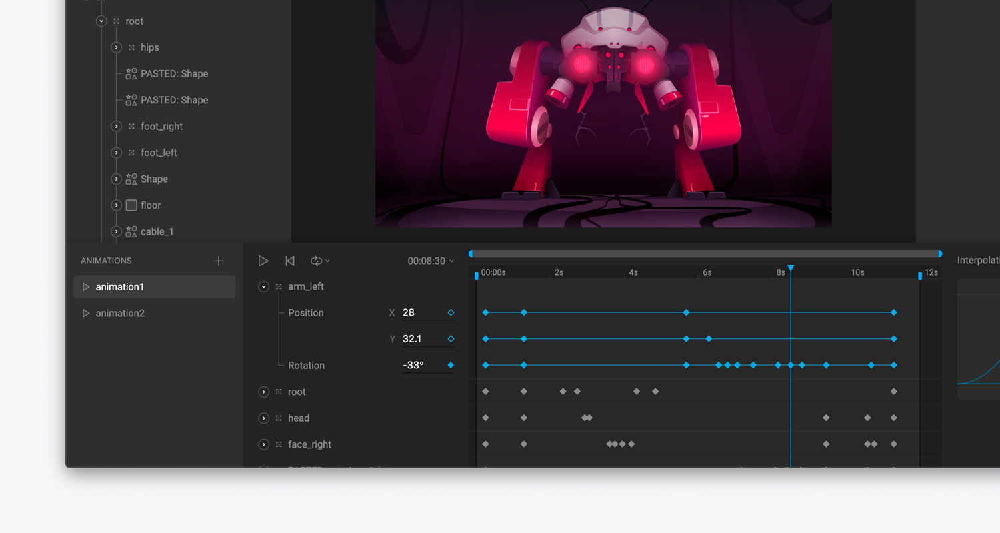

# Animate Mode

Rive has two distinct modes, Design and Animate. When you are in Animate mode, the Editor changes to display everything you need to create your animations including, a timeline, animations list, and interpolation panel.

To quickly switch modes, use the `tab` shortcut.

In Animate mode, you'll notice that properties in the [Inspector](../fundamentals/interface-overview/inspector.md) that can be animated now display a key icon next to them.

### Learn more about Animate mode









