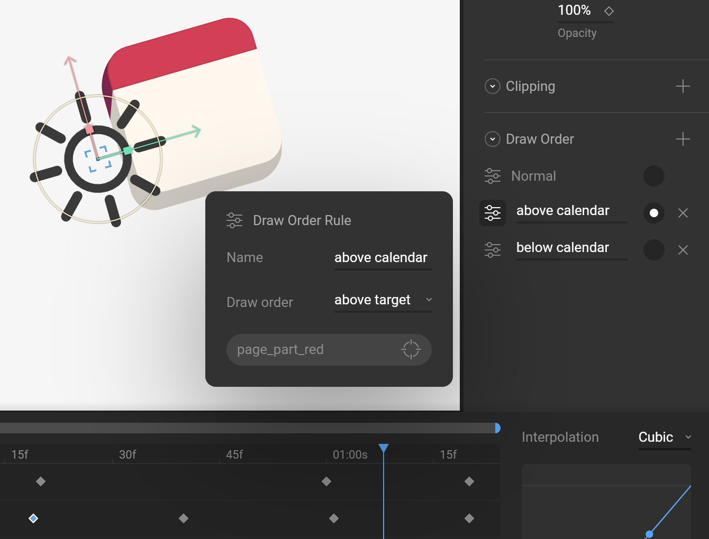
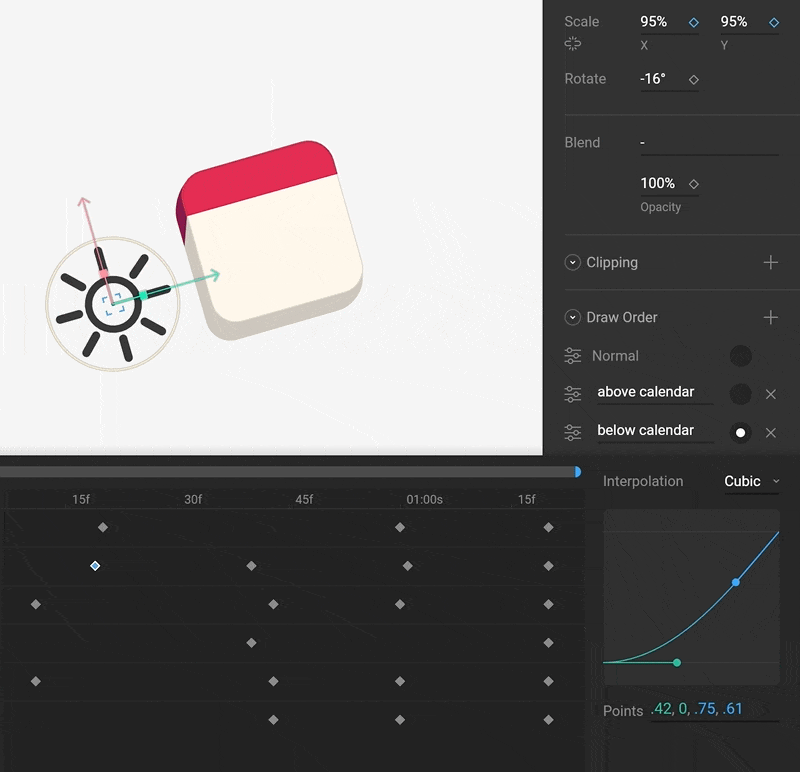

# Animating Draw Order

You can change the draw order of your graphics at design time by moving items up and down the [Hierarchy](../fundamentals/interface-overview/hierarchy.md#draw-order). But what if you want to change the draw order during an animation? Or what if you want to change the draw order without breaking the current hierarchical structure? Rive allows you to accomplish this with Draw Order Rules.

## Draw Order Rules

To animate the draw order of a group or shape, start by selecting it. Use the Draw Order section of the Inspector to create Draw Order Rules.

The Normal rule is the default order \(based on [Hierarchy](../fundamentals/interface-overview/hierarchy.md) order\). When the radio button next to this rule is active, the shape appears at its default draw order. 

Draw Order Rules allow you to select a target \(note that this must be a drawable item, not a group\) and whether to draw above or below the target.


The target must be a drawable item, like a shape. It cannot be a group.


In Animate mode, use the radio button next to the Draw Order Rules to set a key. Note that these are [Hold keys](interpolation-easing.md#hold) as Draw Order cannot be interpolated.  

