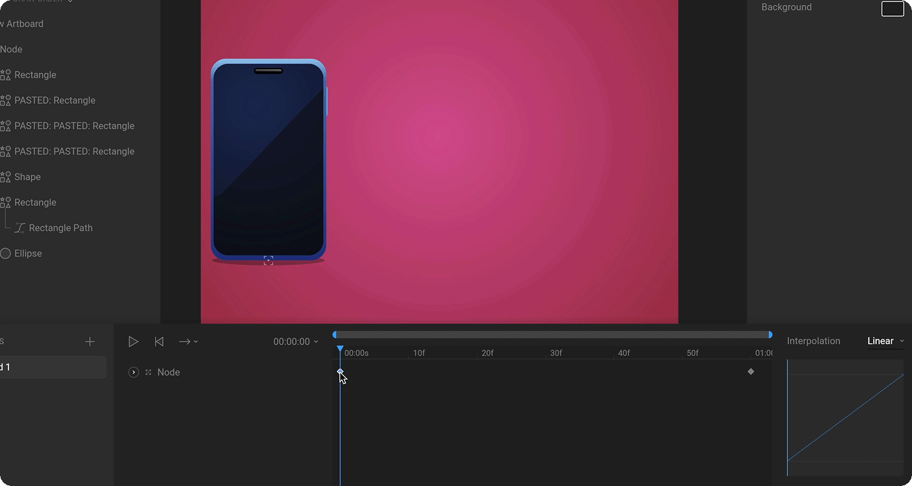

# Interpolation \(easing\)

When you set two keys on a property, the value in between those keys is automatically calculated. This is called interpolation. Interpolation settings can be customized to create dramatically different results.

To change the interpolation type, first, select a key on the timeline. The interpolation pane updates to show how the value will change from the specified key to the next key.

The interpolation graph to the right is a visual representation of how the value will change over time from the selected key to the next with the x-axis representing time and the y-axis representing the change in the chosen property.

### **Linear**

Linear is the default interpolation type, and it creates a constant rate of change from one key value to the next.

### **Cubic**

Cubic interpolation uses a curve to interpolate between key values. It gives you two handles that can be dragged to customize the curve.

You can drag the handles as far as you want on the Y-axis. If you drag the handles outside of the graph, the graph view will update to ensure that the handles are always in view.

The default cubic curve creates a gentle curve from the first key to the next, which results in the value changing slowly at the start and end, and changing the most in the middle.

### **Hold**

Hold doesn't interpolate values between keys. It simply holds the current value until the next key is reached, where the next value is set instantly.  

### Interpolation field

A text field below the preview graph represents the interpolation in a numerical format. A total of four values \(typically between 0 and 1\) represent the position of the handles – two for the inward curve, and two for the outward curve. You can see how these values change by dragging the handles within the preview window.

Use this field if you wish to set specific easing values, perhaps defined in a design language for a specific brand, for instance. The field also makes it easy to copy and paste values across files and tools.

When inputting values manually, use a comma or a space to separate each of the four values. 

