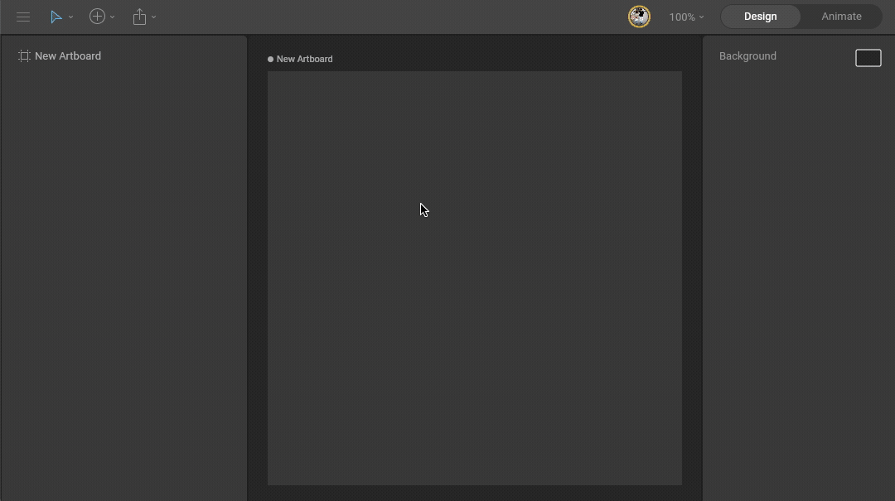
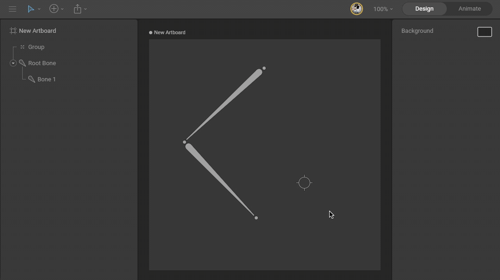
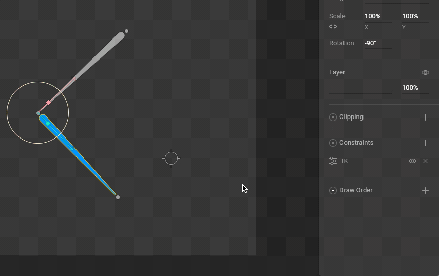
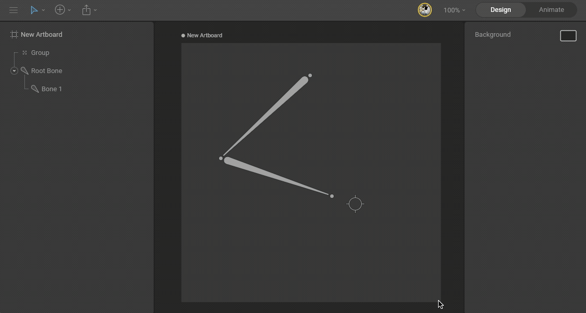
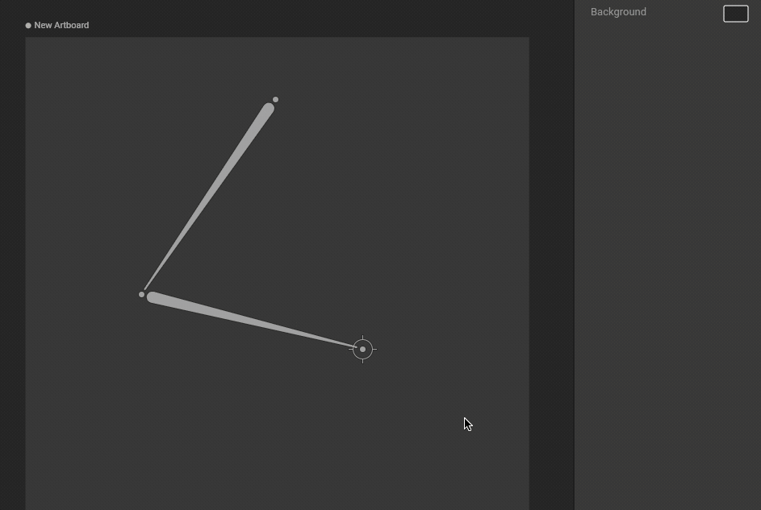
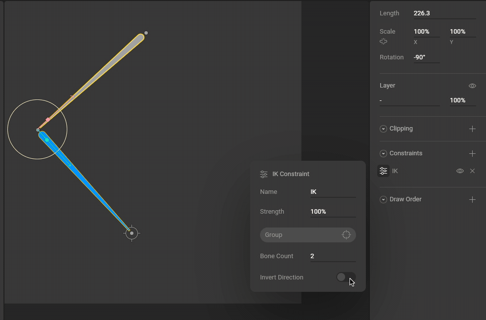
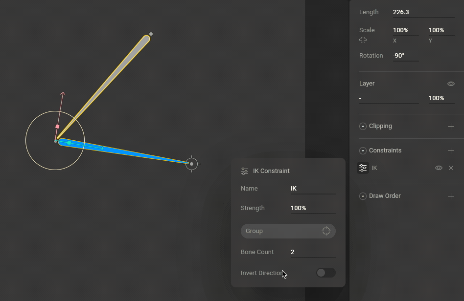
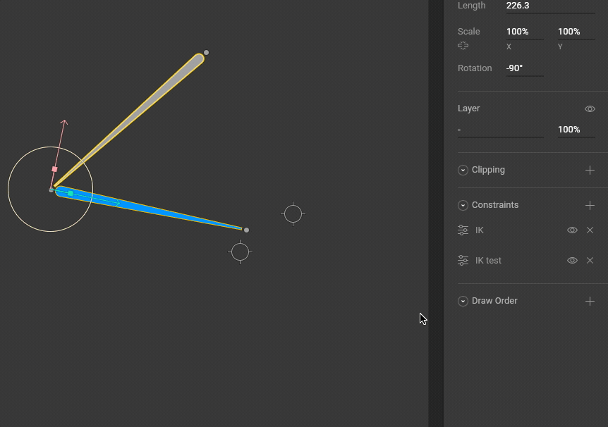

# IK Constraint

## About Inverse Kinematics \(IK\)

### Forward Kinematics

Most skeletal animation in Rive is done by rotating the angles of bones. The position of a child bone changes according to the rotation of its parent. Positioning a bone at the end of a chain requires rotating multiple parent bones \(the bones up the chain\) to reach the desired pose. This type of skeletal posing is called Forward Kinematics.

### Inverse Kinematics

Inverse Kinematics allows you to place a target at the end of the chain and the system works backward to find a valid orientation for the parent bones above it.

There are many applications for this technique, but some of the more common examples include making a character point at an item or making a character's feet stay planted on the ground.

## How to create an IK constraint

To use IK, you need a bone chain and a target. The target can be any object, though in most cases you'll want to use a group with its [Style set to Target](../fundamentals/groups/#group-style).

### 1. Create a bone chain and a target

Use the **B** shortcut to create a [bone chain](../manipulating-shapes/bones/#how-to-create-bones). Then use the **G** shortcut to create a [group](../fundamentals/groups/). Set the group's Style option in the Inspector to Target. 

### 2. Add an IK constraint

Select the last bone you want to affect and add an IK constraint using the Constraints section of the Inspector.

### 3. Select a target

Open the constraint fly-out menu and use the target button to select the empty group created in step 1. 

### 4. Test the IK system

Move the target group to test the system is working.

## Bone Count

Use the Bone Count property to set how far up the chain the IK system should work. Note that bones affected by the IK system are highlighted when the target is selected.

## Invert Direction

Use the Invert Direction toggle to swap the angle at which your IK system solves.

## Strength

Use the Strength property to control how much the influenced bones should follow the target. A Strength of 0% means the target won't affect the influenced bones at all.


Note that Strength can be animated, like most properties in Rive. Use this to create unique effects or to blend between two or more IK constraints \(each with their own target\).


## Constraints order

The order of constraints matters. For example, if a bone has two IK constraints, both with a strength of 100%, the second constraint \(bottom-most\) will cancel out the first one. If they don't have 100% strength, then the IK system will blend between the two. Use drag and drop to change the order of constraints.

## Multiple IK constraints and nested targets

You can set up multiple IK constraints for more complex rigs. A common setup is to have an IK constraint on the feet of a character \(note that in our example below it only affects 1 bone\) and another IK constraint for the leg bones \(two bones\). The leg target is a child of the foot target so that moving the feet will also move the legs.

