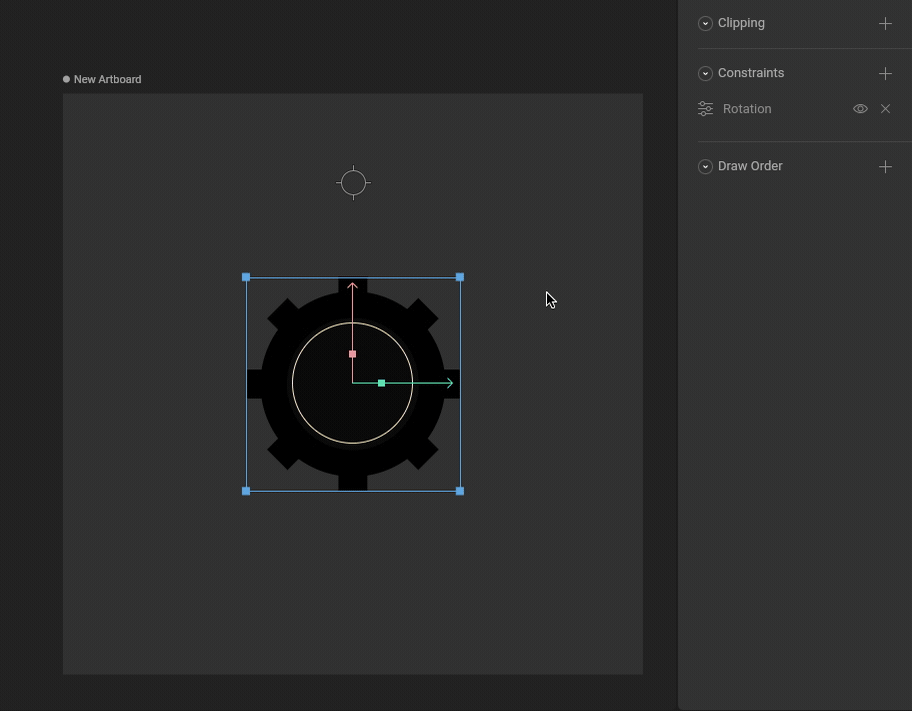
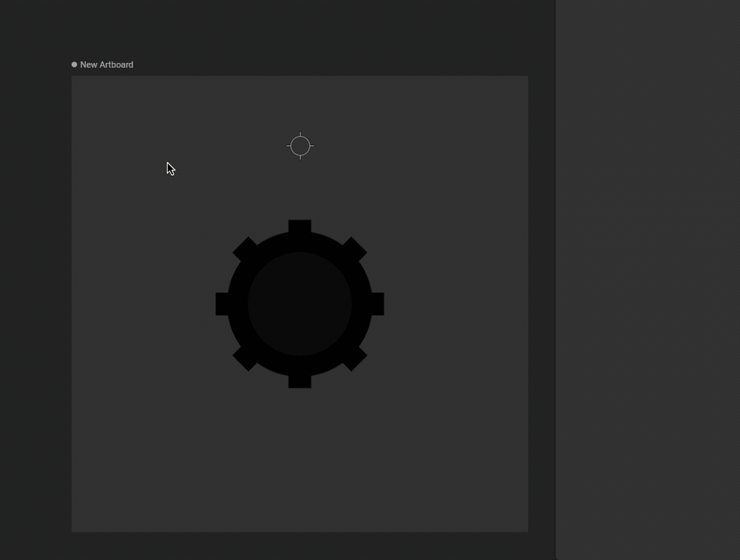
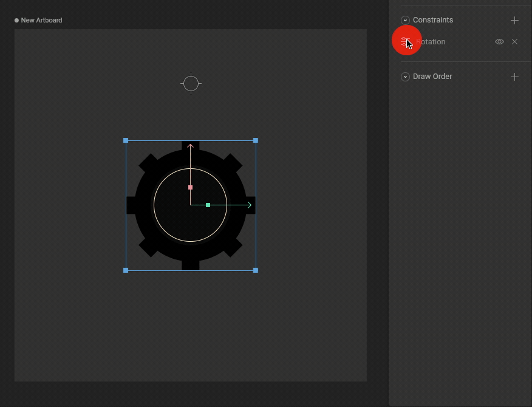

# Rotation Constraint

The Rotation Constraint allows you to set limits on an object's rotation and/or copy the rotation properties from a target object. These properties can be independently activated. 

## How to create a Rotation Constraint

### 1. Add a Rotation Constraint to an object

Use the Constraints section of the Inspector to add a Rotation Constraint to an object.

### 2. Choose a target

Use the new constraint's fly-out menu to select a target for this constraint.

### 3. Test that the Rotation Constraint is working

Manipulating the target object now causes the constrained object to copy Rotation properties.

## Strength 

The Strength property determines how much the constrained object is affected.

A Strength of 0% means the constraint won't have any effect.

A Strength of 50% means half the value from the target will be applied.

## Transform Space

### Source Space

Choose whether this constraint should use World or Local coordinates for the Source Space.

### Destination Space

Choose whether this constraint should use World or Local coordinates for the Destination Space.

### Min/Max Space

Choose whether this constraint should use World or Local coordinates for the Min/Max Space.

## Offset

Allows the constraint owner to be manually offset from the constraint source.

## Copy

Define the rate at which the rotation property is copied.

## Min/Max

Use the numerical values to define the minimum and maximum limits of the constraint.

