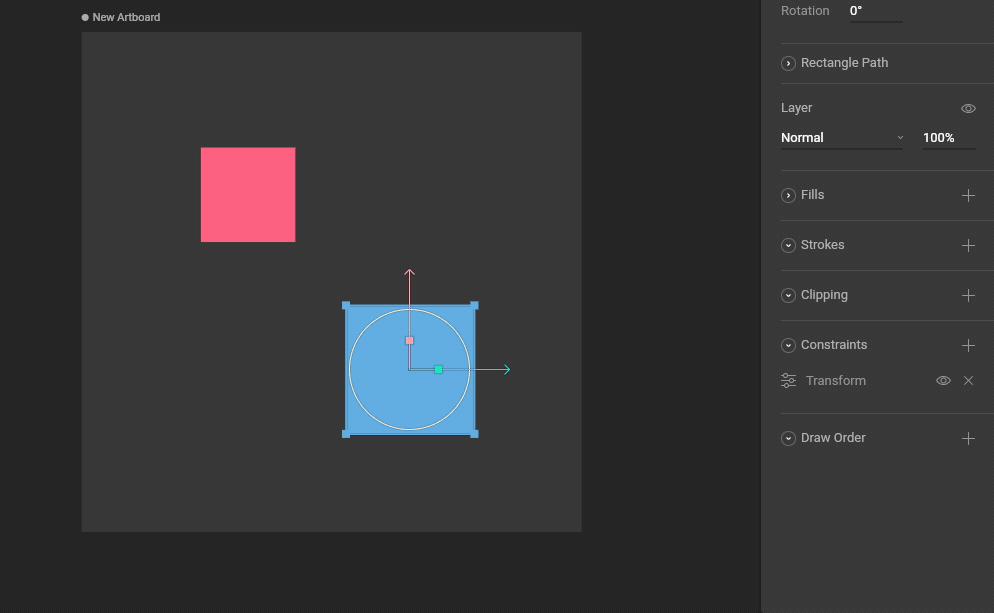
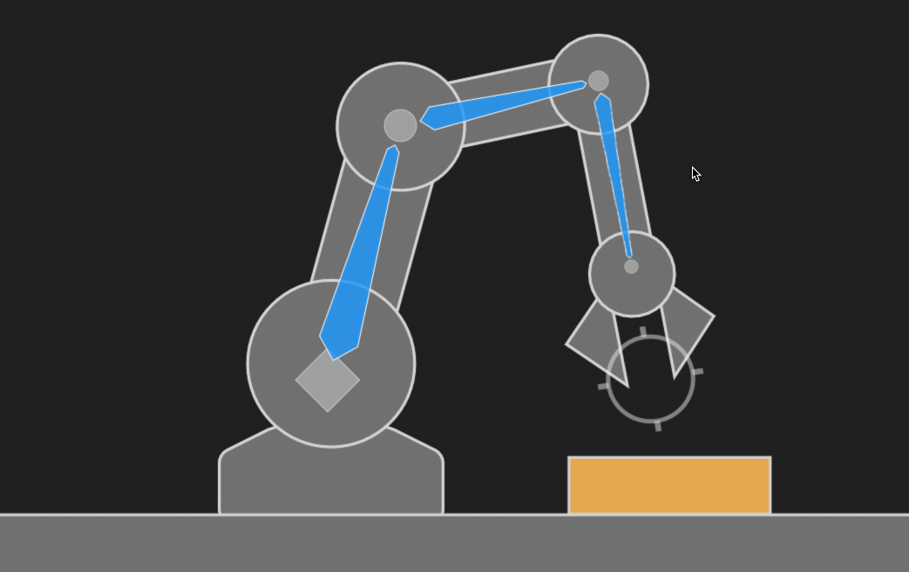
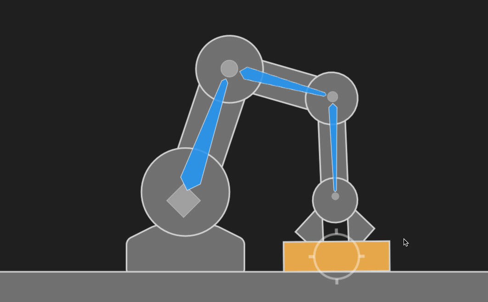

# Transform Constraint

The Transform Constraint allows its owner to copy all the transformation properties from a target object, regardless of their hierarchical relationships. These properties include Position, Rotation, and Scale.

## How to create a Transform Constraint

### 1. Add a Transform Constraint to an object

Use the Constraints section of the Inspector to add a Transform Constraint to an object.

### 2. Choose a target

Use the new constraint's fly-out menu to select a target for this constraint.

### 3. Test that the Transform Constraint is working

Manipulating the target object now causes the constrained object to copy Position, Rotation, and Scale properties.

## Strength 

The Strength property determines how much the constrained object is affected.

A Strength of 0% means the constraint won't have any effect.

A Strength of 50% means half the value from the target will be applied.

## Transform Space

### Source Space

Choose whether this constraint should use World or Local coordinates for the Source Space.

### Destination Space

Choose whether this constraint should use World or Local coordinates for the Destination Space.

## Example: mechanical arm

Consider the package resting on the table and the mechanical arm below.

Add a Transform Constraint to the package and a target group at the end of the arm.

With a Strength of 100%, all the transform properties of the package match the target. Notice how the package moves and rotates correctly with the movement of the arm.

Set the Strength to 0% to make the arm drop the package.

