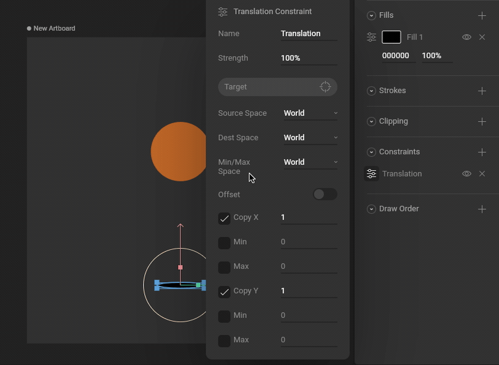
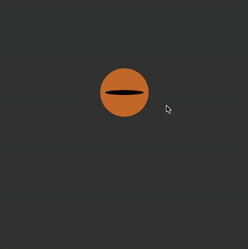
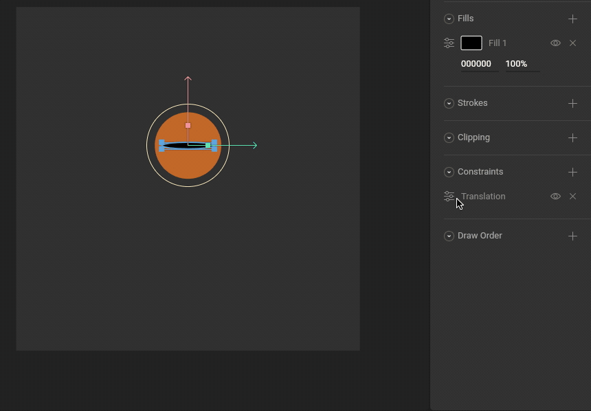

# Translation Constraint

The Translation Constraint allows you to set limits on an object's position and/or copy the position properties from a target object. These properties can be independently activated. 

## How to create a Translation Constraint

### 1. Add a Translation Constraint to an object

Use the Constraints section of the Inspector to add a Translation Constraint to an object.

### 2. Choose a target

Use the new constraint's fly-out menu to select a target for this constraint.

### 3. Test that the Translation Constraint is working

Manipulating the target object now causes the constrained object to copy Position properties.

## Strength 

The Strength property determines how much the constrained object is affected.

A Strength of 0% means the constraint won't have any effect.

A Strength of 50% means half the value from the target will be applied.

## Transform Space

### Source Space

Choose whether this constraint should use World or Local coordinates for the Source Space.

### Destination Space

Choose whether this constraint should use World or Local coordinates for the Destination Space.

### Min/Max Space

Choose whether this constraint should use World or Local coordinates for the Min/Max Space.

## Offset

Allows the constraint owner to be manually offset from the constraint source.

## Copy X &Y

Allows you to decide if the constraint owner will copy the translation in the X and Y direction. Additionally, use the numerical value to define the rate at which it copies the value.

## Max/Min

Use the numerical values to define the minimum and maximum limits of the constraint.

