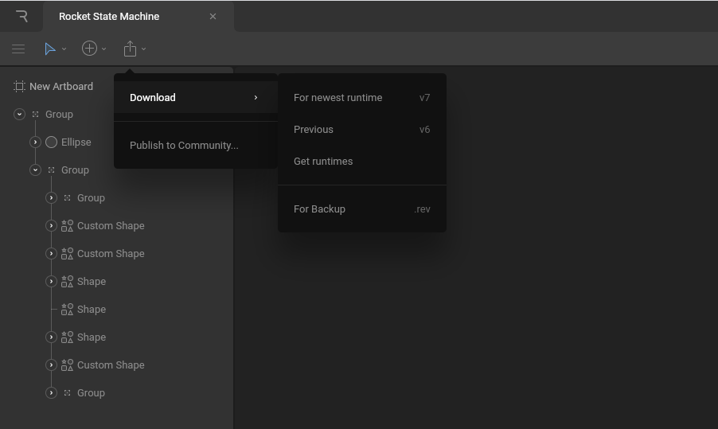
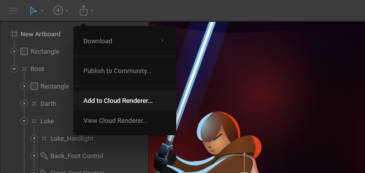
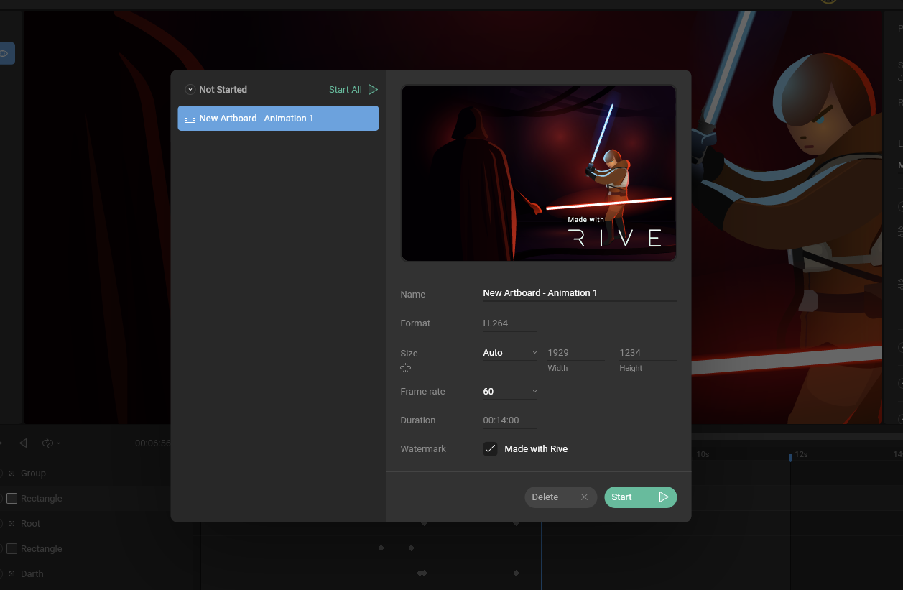

# Exporting

## Exporting for real-time content

You can load your Rive files into apps, websites, products, and games thanks to the open-source [Rive Runtimes](../runtimes/overview.md). To load your files in our runtimes, you'll need to export a **.riv** file.


Note that **.riv** files are optimized for runtime so any non-runtime-related data \(like x/y coordinates of [states](animate-mode/state-machine.md#states)\) are stripped out.


### Via the Editor

Export your file via the export menu within the toolbar. Select Download from the dropdown menu.

#### For newest runtime

This option downloads a **.riv** file that is compatible with the latest major version of the Rive runtimes \(number displayed on the right\). You can use the [Get runtimes](../runtimes/overview.md) button to find all our latest runtimes. 

#### Previous

This option downloads a **.riv** file that is compatible with the previous major version of the Rive runtimes \(number displayed on the right\). Use this if you haven't updated to the latest major version. 

#### For backup

This option downloads a **.rev** file that is intended for backup. It contains all the data that gets stripped out from runtime files. If you drag this file back into the Editor, it'll restore all properties \(including coordinates of state machine states\). 

### **Via the File Browser**

Right-click files from within the browser and select Export from the contextual menu. Use marquee selection by clicking and dragging to export multiple files at once.

Alternatively, right-click on a folder to export all the containing files.

## Exporting linear content \(video\)

Rive is all about interactive animation, but sometimes you need a good old-fashioned video. Our Cloud Renderer turns any device into a supercomputer, allowing you to continue working while we generate your videos.

### How to render

To render an animation, open up the timeline you want to render \(in [Animate Mode](animate-mode/)\). Then open up the Export Menu and select Add to Cloud Renderer.

This opens up the Cloud Renderer. Add multiple videos to a queue and set them to render either one-by-one or all at once. Our services do the heavy lifting while you continue working.

If you're on a team plan, you can remove the "Made with Rive" watermark and set custom properties like Frame Rate, Bitrate, and Size. If you're on the free plan, your render will use the default options. 

