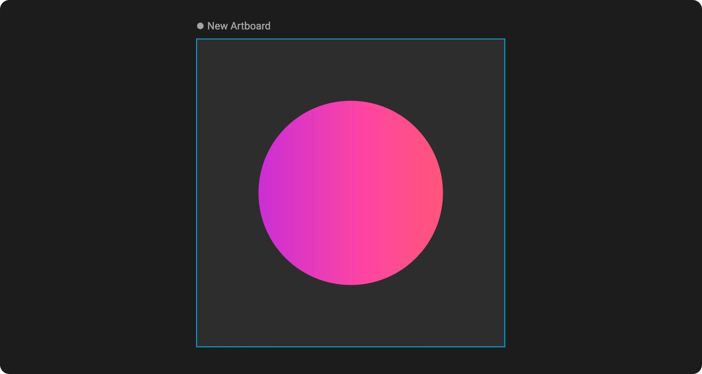
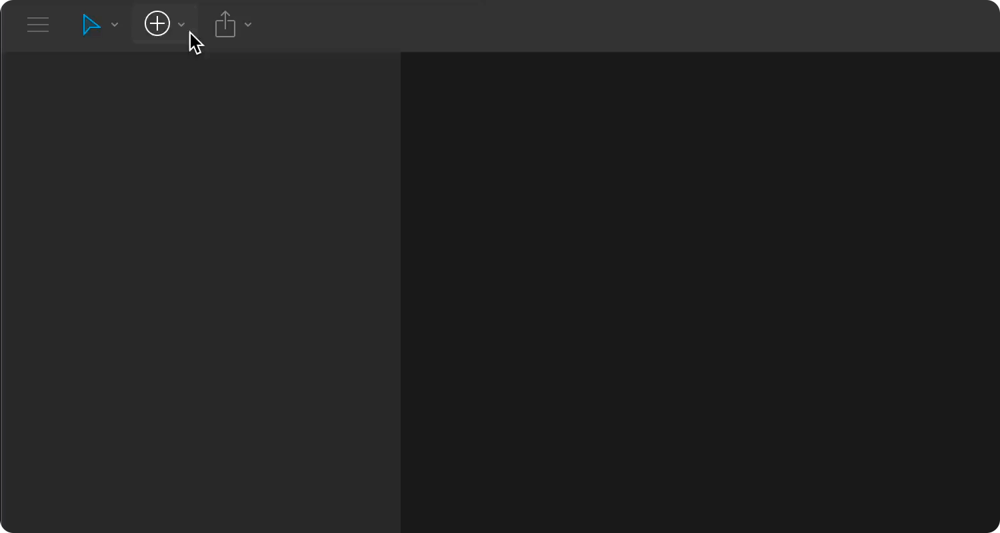

# Artboards

Artboards are the foundation of your composition across both design and animate mode. They act as the root of every hierarchy and allow you to define the dimensions and background color of a scene. You can create an infinite amount of artboards on the [Stage](interface-overview/stage.md), but each Rive file has at least one artboard.

To learn more about Artboards, watch our video on Artboards or read more below.



## **Active artboard**

The active artboard is represented with a dot next to its name on the stage. You can activate an artboard by clicking on it or any of its children within the stage. Note that sections of the editor will only surface content associated with the active artboard. For instance, only the active artboard's hierarchy is displayed in the tree. Similarly, only animations referenced to the active artboard will surface within the timeline.

## **Creating an artboard**

Before creating any graphics, you'll first need to create an artboard. Select Artboard from the Create Tools menu within the toolbar, or use the `M` shortcut. Click and drag to define the bounds. You can always adjust the size and position by selecting the artboard in the [Hierarchy](interface-overview/hierarchy.md) to surface its properties in the [Inspector](interface-overview/inspector.md).

## Artboard properties

Every artboard has various properties that can be changed in the [Inspector](interface-overview/inspector.md). Some of the attributes that can be changed include an artboard's position on the [Stage](interface-overview/stage.md), its size, fill color, and the origin point.  

