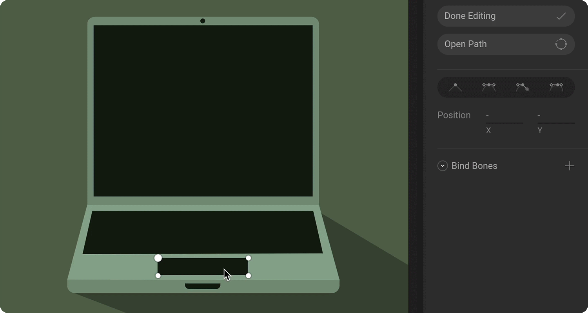

# Tips and best practices

When working with vector shapes, you have the luxury of editing the vertices of your shapes at any time \(this includes animate mode\). Whether you need to add extra vertices, change the type of bezier handle, or change the position of an errant vertex, everything is available to you regardless of where you created your graphics.

## Use procedural shapes as a base 

Often, procedural shapes give you a great starting point for the shapes that you want to create. By editing a procedural shape, you can save yourself some time instead of creating the shape with the pen tool.

The hills in this example were created by editing two vertices of an ellipse. 

For this example, the keyboard and touch-pad are both made with a rectangle that has it's bottom two vertices translated for perspective. 

## Change handles

Sometimes, you'll need to change the type of handles a vertex is using to create the shape you want. 

Each handle will have its own unique use case, and you'll need to experiment with them to learn exactly when to use each.

