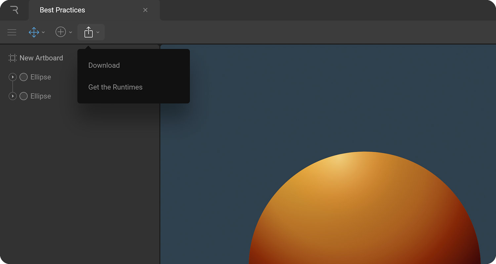

# Exporting files

There are a number of ways to export your Rive files ready to load into our runtimes.

### **Via the Editor**

Export your file via the export menu within the toolbar. Select Download for runtime from the dropdown menu.

### **Via the File Browser**

Right-click files from within the browser and select Export from the contextual menu. Use marquee selection by clicking and dragging to export multiple files at once.

Alternatively, right-click on a folder to export all the containing files.

### **Via the API \(coming soon\)**

### **Cloud render \(coming soon\)**

