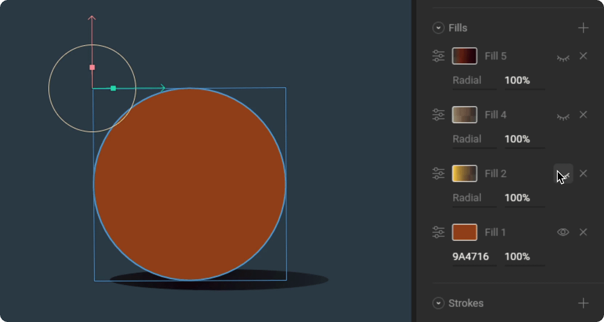

# Tips and best practices

Although shapes and paths define the shape of your graphics, it's the fills and strokes that will give your graphics form. Here are a few ways to use fills and strokes to bring your creations to another level.

## Use multiple fills and gradients

Instead of relying on a single fill layer to add color to your shape, try using multiple fills. By using a mix of solid and gradient fills, you can create a textured effect. Keep in mind that you'll need to adjust the gradient stoppers' alpha so that all of your layers are visible.

## Use gradients on strokes

Much like fill layers, you can add gradients to your strokes. While this won't fit with every style, it is a good way to create rim lighting. 

## Use caps and joins

Instead of leaving the corners and ends of your stroke at the default setting, try using the various cap and join options. 

