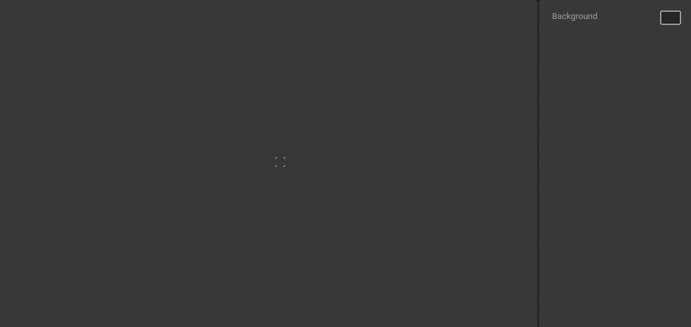

# Groups



Use groups to organize your graphics or to add extra transform spaces.

Activate the Group tool with the `G` shortcut. Click anywhere in an artboard to add a new group. Now drag and drop objects into the group in the Hierarchy.

You can also wrap a selection of shapes into a group with `⌘`+`G` in macOS or `Ctrl`+`G` in Windows.

Unwrap a group with `⌘`+`Shift`+`G` in macOS or `Ctrl`+`Shift` +`G` in Windows.

## Group Style

The Style property of a group can be set to Group or Target.

### Group

Group is the default behavior, which behaves as described in the [Selecting and Navigating Groups section](selecting-and-navigating-groups.md).

### Target

The Target option draws a different icon on the Stage that is always visible, regardless of whether the group has children (usually a group only displays an icon if it is empty). When a group displays as a Target, it also disables the functionality described in [Selecting and Navigating Groups](selecting-and-navigating-groups.md) section. This means you can immediately click through to any child of the group (no need to [double-click](selecting-and-navigating-groups.md#double-click),[ enter/esc](selecting-and-navigating-groups.md#enter-and-esc-shortcuts), or [Deep Select](selecting-and-navigating-groups.md#deep-select)).

The Target option is particularly useful when working with [Constraints](../../constraints/).

