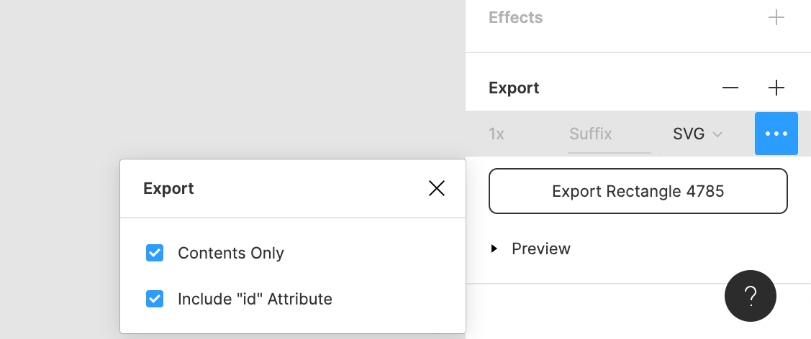

# Importing assets

Import your assets by dragging and dropping them onto the Rive editor. In doing so, the editor generates an artboard and associated hierarchy for you to begin working with.

### Assets panel \(coming soon\)

We'll soon be adding an assets panel to manage and access all your imported assets in a file. See more about this on our [public roadmap](https://feedback.rive.app/116).

## Supported formats

Currently, only SVGs can be imported into Rive, however, we'll be adding a range of other formats soon!

## SVG Tips

SVG is a very flexible and feature-rich format. We aim to support SVG as best we can, however, there are some features that we do not support at this stage. 

When exporting files as SVG, exporting with inline style as opposed to CSS will work best for our importer.

When exporting from other design tools, look for the option to retain id's and names of your shapes when you export. This will ensure that your imported file retains the same structure and layer names. Most tools have an option for this, as in the Figma example below.

#### Photoshop:

When exporting from Photoshop, make sure you're only using vector layers. Don't convert or flatten anything to raster.

#### Illustrator:

When using "Save As" to export an SVG from Illustrator, select "Style Attributes" from the CSS Properties instead of the default option. Thanks to [V.lang on our feedback site for figuring this out](https://feedback.rive.app/122)! Be sure to also disable the "Preserve Illustrator Editing Capabilities" as this will make your file much larger and add data that is not recognized by our importer. 

#### Known Issues: 

* Embedded images are ignored, we are planning to implement this \(for more info [see here](https://feedback.rive.app/69)\).
* Filters, shaders, and gradient transforms are ignored. 
  * We currently cannot provide equal support for this across our runtimes, so this is not supported.
  * We do support linear and radial gradients, however, which can cover some use cases.
* Rive does not have a concept of point \(pt\) or millimeter \(mm\) sizing. An SVG that uses dimensions provided in pt or mm will have their values converted to pixels \(px\). Points are converted to 1.33 px and millimeters are converted to  3.78 px. 
* SVG provides `inherit` to let stroke and fills to use the color of their ancestors. Rive does not support this and any inherited color defaults to white.

**Coming soon**

We plan to add raster image support, [track the feature on our public roadmap and feedback site](https://feedback.rive.app/69).

