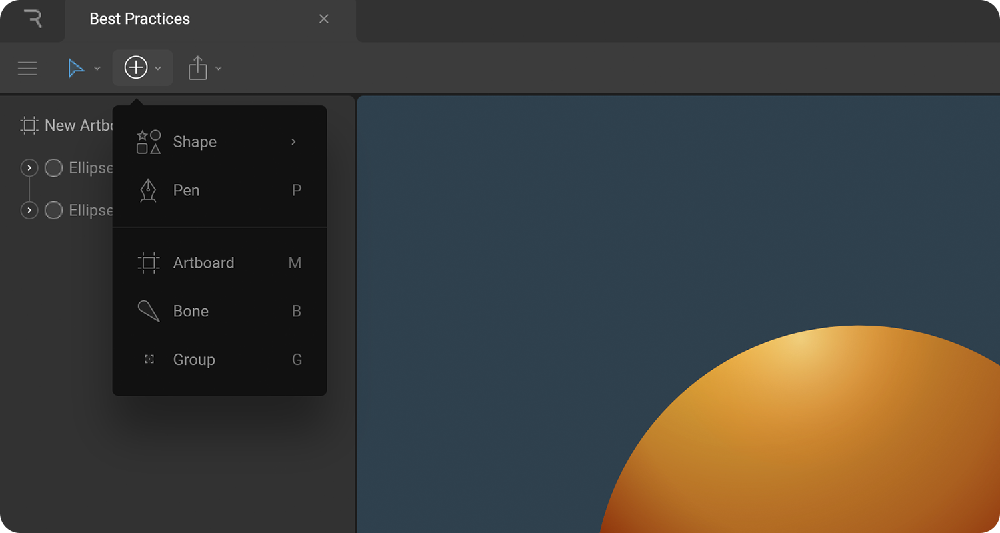
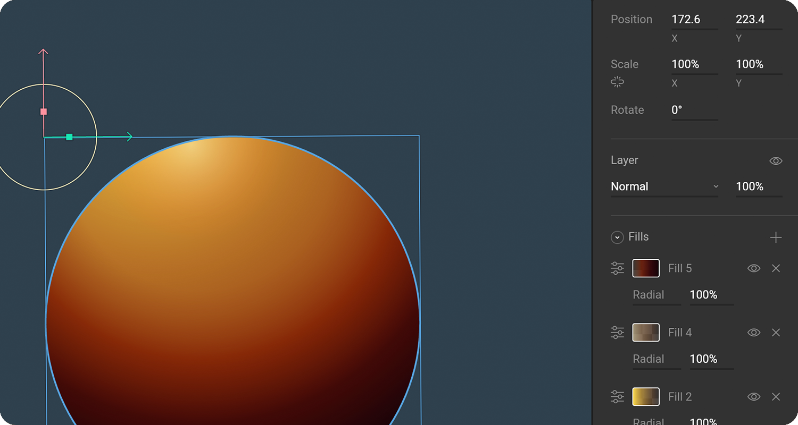
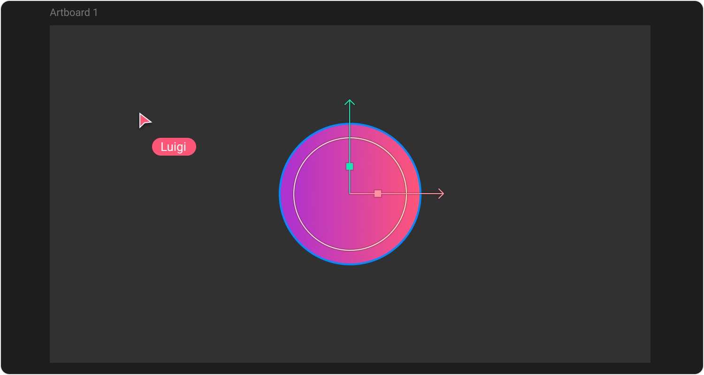

# Interface overview



## Toolbar

The Toolbar displays the tools you have available to manipulate and create items on the stage. In addition to these tools, the toolbar houses a variety of options to allow you to customize the look of your file.

Read more on the Toolbar page.



## **Hierarchy**

All the stage objects, assets, controls, and animations that make up your file appear in the Hierarchy.



## **Inspector**

The Inspector allows you to adjust the properties for the currently selected object. In Animate mode, you will only see properties that can be animated.

Read more on the Inspector page.



## **Stage**

The stage refers to the central area between the toolbar, the hierarchy, and the inspector. Here you can create the artboards that are the foundations of your designs and animations within Rive.

Read more on the Stage page



## **Timeline**

The Timeline surfaces from the bottom of the screen upon entering animate mode. Here you can create new animations, access playback controls, and settings, and set keyframes for object parameters. Select an animation from the left-hand list to switch between the respective timelines.  

Read more on the Timeline page.



