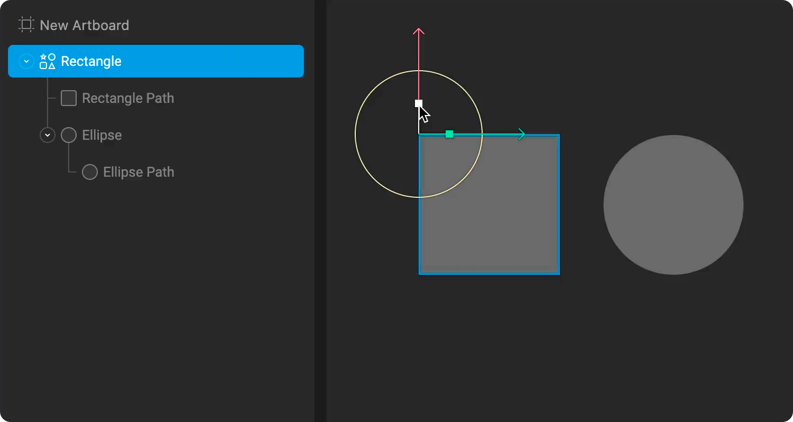
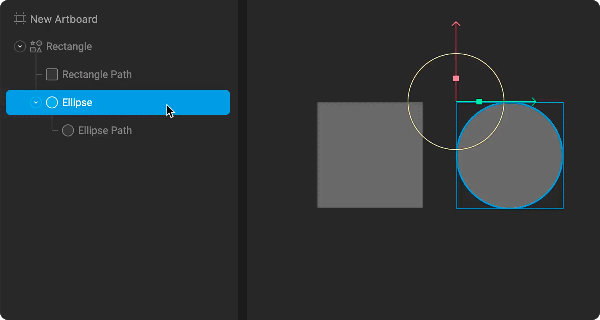
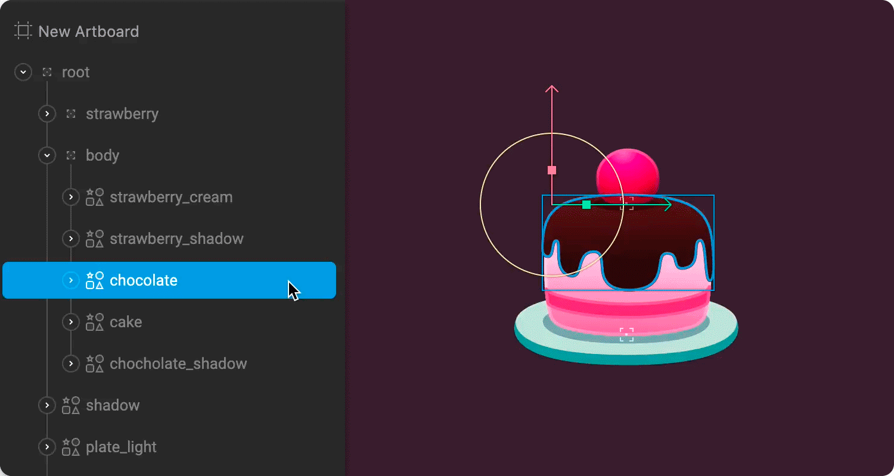
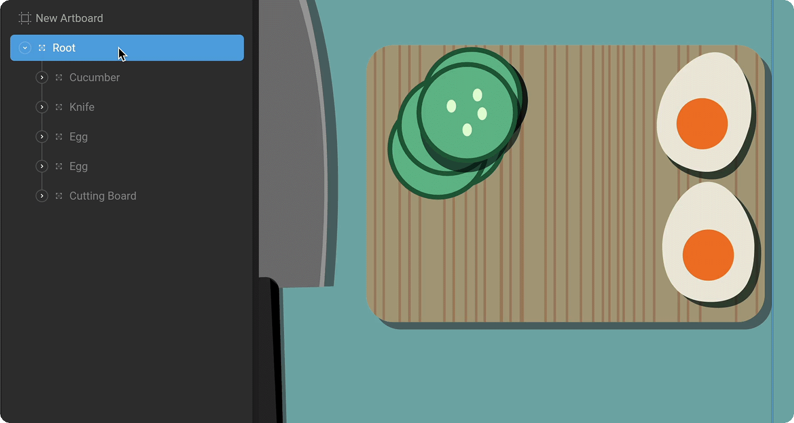
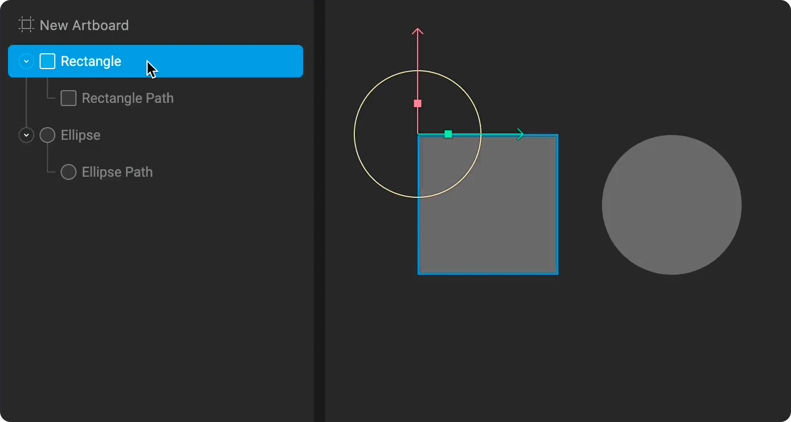

# Hierarchy

The Hierarchy is a tree view, which shows both the parent/child relationships between objects on the stage as well as the order in which they are rendered. Learn about the Hierarchy by either watching the video or reading more below.



Parent/child relationships are a core concept in Rive, which allows you to create complex layered animations with minimal effort. [Groups](../groups/), [Bones](../../manipulating-shapes/bones/), and Solo objects can all have children in Rive.

Each row in the Hierarchy represents an item on the stage. A circle button with an arrow appears next to items that have children nested underneath them. This button allows you to expand and collapse the list of children.

## Parent-child relationships

Any type of object can be a parent or a child of another type of object. When an object is a child of another object, it inherits all the transformations of its parent.

The depth of these parent/child relationships is infinite, so you can keep stacking \(or nesting\) items to create grandchildren, great-grandchildren, and so on.

## Change parent/child relationships

To change the relationship between objects, drag and drop the object onto or out of another.

## Draw Order

In addition to displaying the relationships between objects, the Hierarchy shows you the Draw Order of a file, with the objects at the top being rendered in front, and the objects at the bottom being rendered at the back.

## Change Draw Order

To change the Draw Order of objects on the stage, drag and drop the shape, or group of shapes above or below another in the list. 

The Draw Order can be animated, but the process is a bit more in-depth. Read about it on the Animating Draw Order page.

## Reverse Draw Order

You can reverse the entire draw order of an Artboard by right-clicking on any object in the hierarchy and selecting Reverse All.

If you only need to reverse the Draw Order of a group, right-click on an object within a group and select Reverse.

## Renaming

You can change the name of any object by double-clicking the name.

