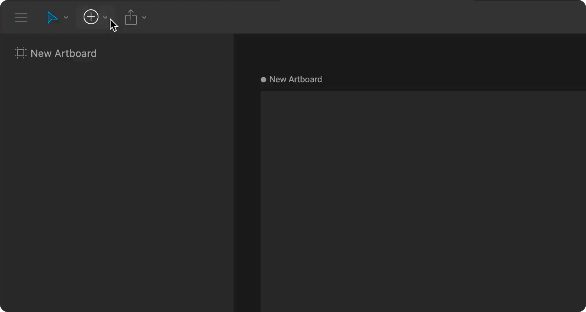

# Pen tool

## Creating **custom shapes**

The pen tool allows you to create custom vector shapes. Activate the Pen tool by finding it under the Create Tools menu or by using the `V` shortcut. 

Click on the stage to place vertices.

Click and drag to create a vertex with bezier handles. When you are finished, hit `esc` on your keyboard.

