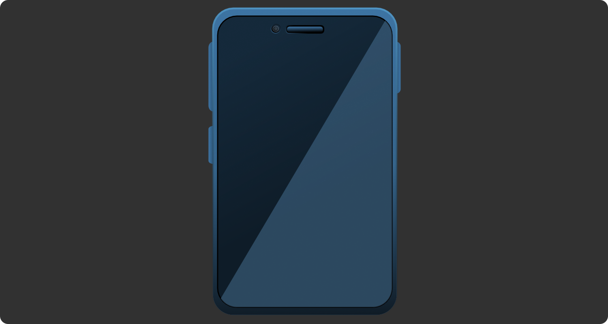
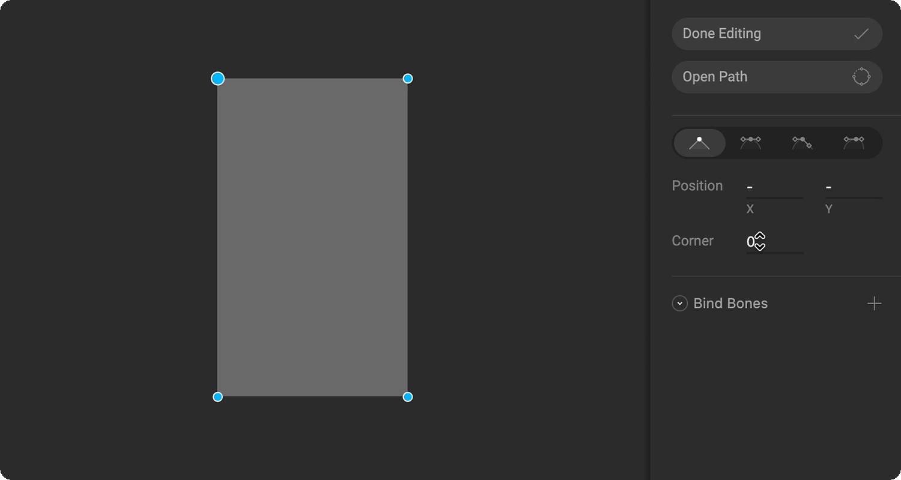
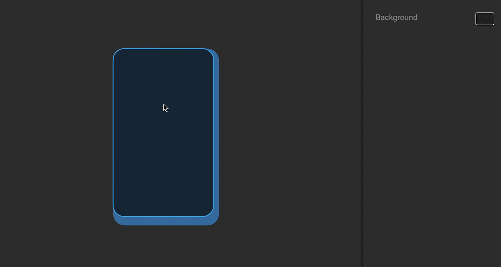

# Procedural Shape Tips

Creating impactful graphics doesn't always involve using complex shapes or techniques. You can create many unique graphics using only simple shapes and functions within the Rive editor. This example shows you a few different ways to use procedural shapes and some of the practices we use as designers at Rive.

## Corner radius

When you create a rectangle, you aren't limited to having square corners. By using the corner radius you can create rounded corners without attempting to create them with the [pen tool](../pen-tool/).

## Snapping

When you are positioning your shapes, especially when you are trying to center one shape on another, let snapping do the work for you.

## Duplicate and adjust

Once you create a detail, you can duplicate it and edit its properties to create even more details.

## Fills and stroke

Use a mix of solid colors and gradients for your [fills and strokes](../fill-and-stroke/) to help your graphics pop. When using a gradient, you can change the alpha of any stopper to help blend it with the shape. 

