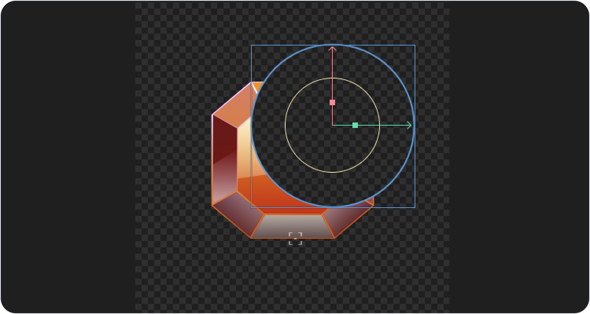
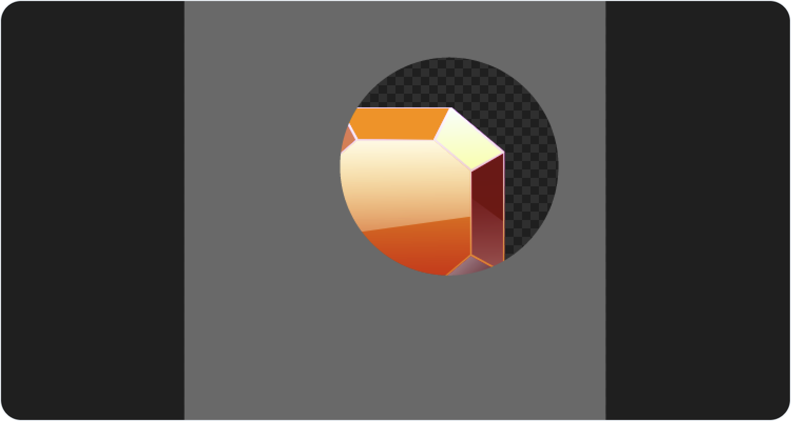
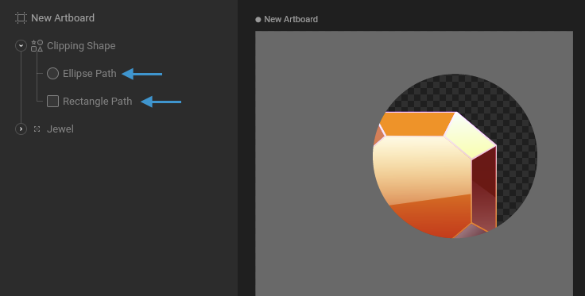
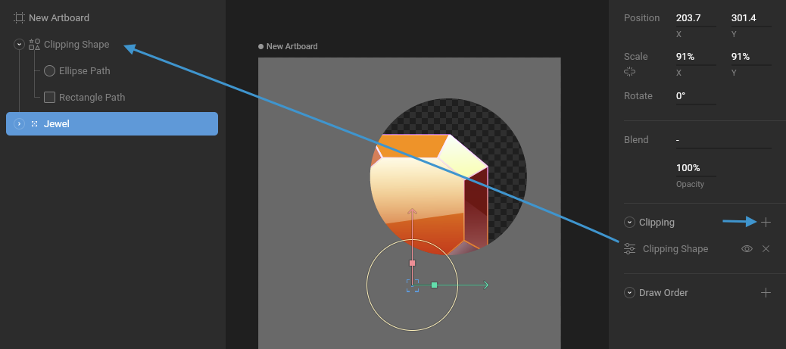
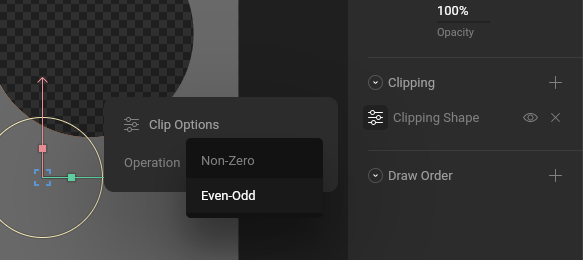
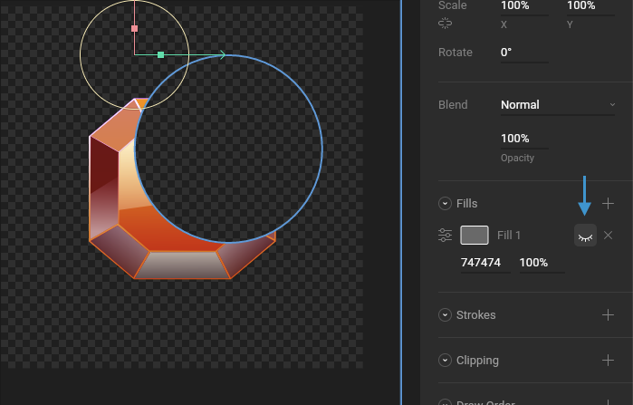

# Clipping


This article is out of date! Find the [new version here](https://rive.app/community/doc/clipping/docbYLdCButS).




## How to use Clipping

Select the shape you want to clip and hit the plus button next to the Clipping options in the Inspector. Now, select the path you want to use as a clipping path.

You can add as many clipping paths to a shape as you'd like.

## How to use a group as a clipping path

Instead of selecting multiple clipping paths one-by-one, you can select a group and all the paths inside the group will be used as clipping paths. In this example, we are adding the ball group as a clipping path to the light shape, which creates a lighting effect on the ball as it moves across the screen.

## Clipping and path direction

In the event that you have shapes that aren't clipping, or only partially clipping, be sure to check the winding of that shape. In most cases, reversing the direction of the path with fix this problem.

&#x20;

## Inverse Clipping

Clipping is typically used to hide a part of your graphics. In the example below, we're using an ellipse to show only part of our jewel graphic.

You occasionally may want to invert the clipping, so that only the graphics outside of the clipping paths are drawn.

This is achieved using a clipping path that looks like the gray shape in the image below.

To create this shape, draw a rectangle the size of the artboard. Add both the rectangle path and ellipse path to the same shape layer in your Hierarchy.

Note that your shape might not show a hole as ours does. That's because you need to set the Fill Rule of your shape to Even-Odd. This setting doesn't affect your Clipping Path, but it helps explain how the Even-Odd operation works, which will be useful later!

Select the group containing the jewel and use the "plus" icon in the Clipping section of the Inspector to add your clipping shape.

Open the Clip Options and set the Operation to Even-Odd.

Be sure to hide the visibility of your clipping shape so it's not covering your graphic.

