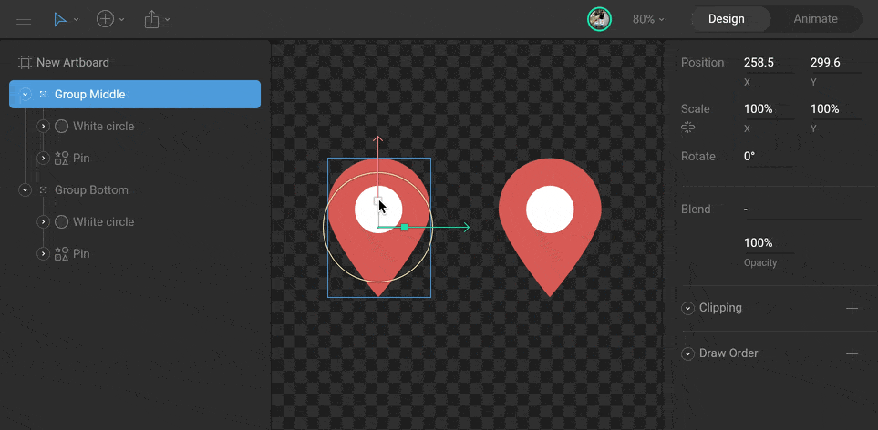
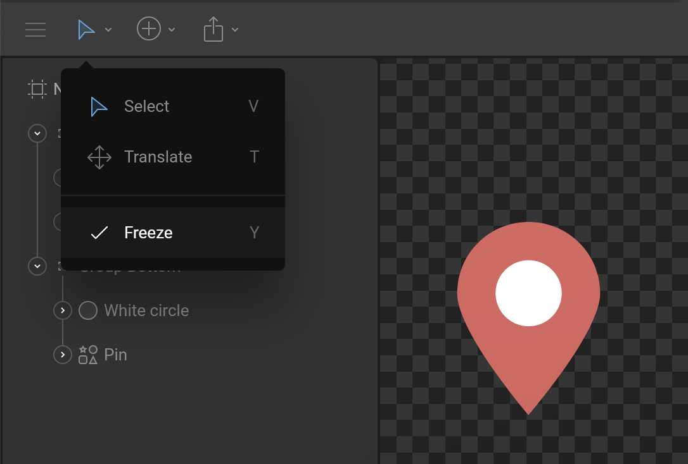

# Freeze and Origin


This article is out of date! Find the [new version here](https://rive.app/community/doc/freeze-and-origin/docc6CFtaMoZ).




When you transform objects, their children inherit the same transformations. The location where these transformations happen (sometimes called the origin, anchor point, or pivot) affects how your objects animate.

For example, manipulating the scale of a group creates different results if the scale originates in the center or the bottom.

To change the point of origin for these transformations, you need to reposition the parent group. However, moving a parent causes all the children to move with it. The Freeze feature makes it possible to achieve this without having to rework the structure of the hierarchy.

## Freeze

The Freeze feature allows you to move any parent object (groups, shapes, bones) without affecting the position of its children. Activate Freeze in the [Transform Tools menu](../fundamentals/interface-overview/toolbar.md#transform-tools-menu) or use the `Y` shortcut.

Now you can reposition the parent object.

Be sure to turn off Freeze by pressing `Y` again.

## Origin

Procedural objects (like artboards and procedural paths) have an origin property. The origin of a procedural path determines where its properties originate from. For example, changing the width of a rectangle with its origin in the middle (50% X and 50% Y) causes it to grow from its center.

Changing the width on a rectangle with its origin on the left side (0% X) causes it to grow from its left.

This is particularly useful when animating paths that have other procedural properties enabled, such as rounded corners.

You can use the Freeze feature to change the Origin position on the Stage. Alternatively, set the exact value in the Inspector.
