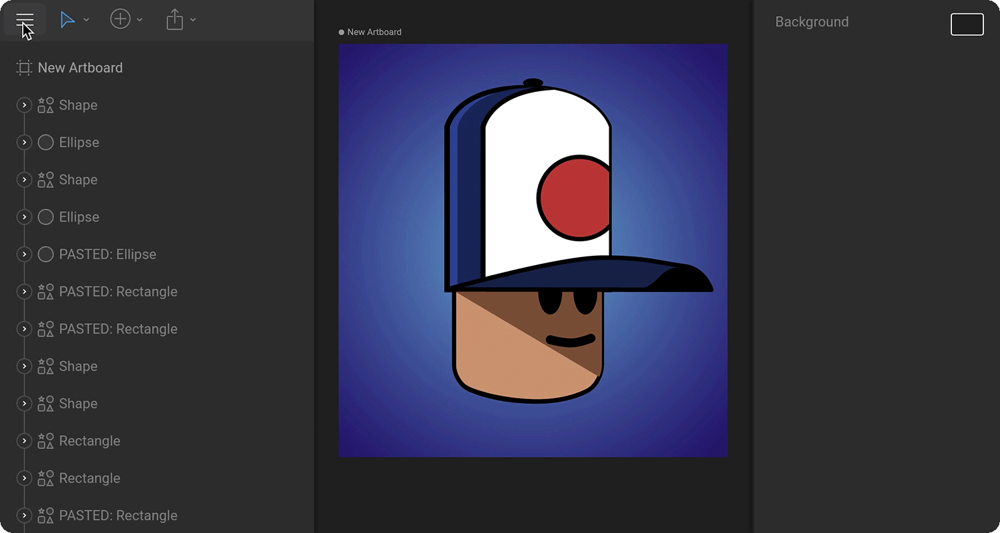

# Revision History

Rive saves your files automatically as you work. Even if multiple people are working on the same file at the same time, Rive tracks all changes and stores them in the Revision History.

## View a file's history

The Revision History can be accessed from the [Editor Menu](fundamentals/interface-overview/toolbar.md#editor-menu).

## Restore a revision

Select a revision to preview it and press the Edit Current Revision button. This copies the selected revision and creates a new entry at the top of the list. This guarantees that even restoring revisions is non-destructive and you can always go back to the previous version of the file.

