# State Machine

State Machines are a visual way to connect animations together and define the logic that drives the transitions. They allow you to build interactive motion graphics that are ready to be implemented in your product, game, or website.

State machines create a new level of collaboration between designers and developers, allowing both teams to iterate deep in the development process without the need for a complicated handoff.



## Create a State Machine

To get started, you first need some timeline-based animations.

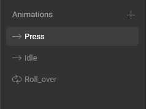

Then create a State Machine.

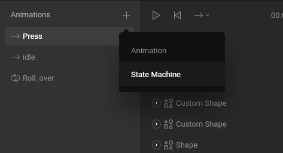

### States

With the State Machine selected, drag and drop your animations onto the graph on the right.

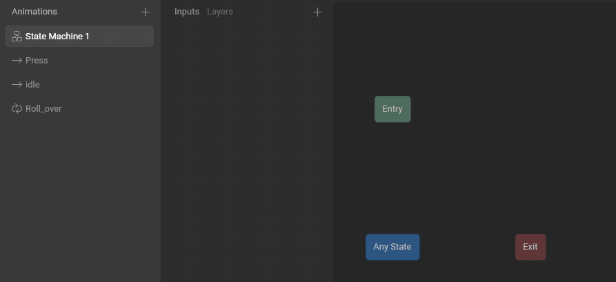

### Create Transitions

Connect your new states with Transitions. When you hover near a state, you'll see a dot appear. Click and drag on that dot to draw a transition from one state to another. The transition from the **Entry** state defines which state should play first. A transition from the **Any State** will happen regardless of what state is currently active, provided the conditions on that transition are met \(read below for more on conditions\). A transition to the **Exit** state will exit the State Machine.

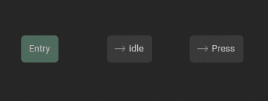

### Inputs

Before adding logic to Transitions, you need to create at least one Input. Inputs are values that are controlled by your app or game engine.

Think of them as the contract between your design and engineering teams. Your product's code can change the values of the Inputs at any time, and the State Machine reacts to those changes.

You can change these values while the State Machine is playing in the Editor or at runtime in your app, game, or website. In this case, we're going to use this Input to determine when a button is pressed, so we're going to name it "Pressed."

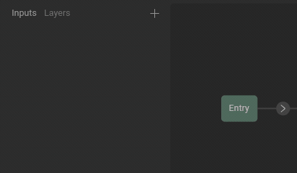

### Transition properties

Select a transition to view its properties.

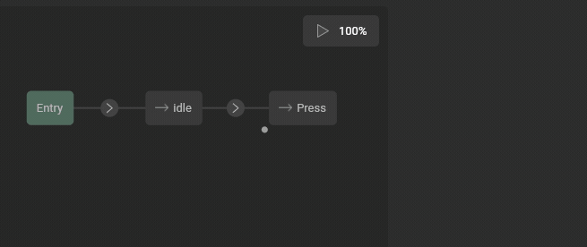

**Duration** determines how long the two animations \(in this case Idle and Press\) will mix. A value of 0 has no mixing and instantly changes from one state to the next. Duration can be a fixed time value \(milliseconds or seconds\) or it can be a percentage \(based on the length of the beginning state\). 

**Exit Time** determines how much time must pass before the transition can happen \(even if the conditions have already been met\). This can be useful if you have an animation that needs to reach a specific point before it transitions. You can use time values \(milliseconds or seconds\) or a percentage. A value of 100% means that the transition can only happen once the entire animation has played.

Use **Pause When Exiting** if you want to hold the current frame \(of the beginning state\) when the transition started.

### Conditions

A transition can have no conditions, one condition, or multiple conditions. If it has no conditions, then the transition happens as soon as **Exit Time** has been reached. If a transition has any condition, then all conditions must be met before the transition happens.

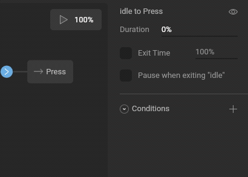

If you have **Exit Time** enabled, then the transition happens once all conditions are met and the exit time has been reached. Use this to ensure your transition happens at a specific time of your animation.

### Play the State Machine

Press the play button to start the State Machine. Change the Inputs to test how your State Machine responds.

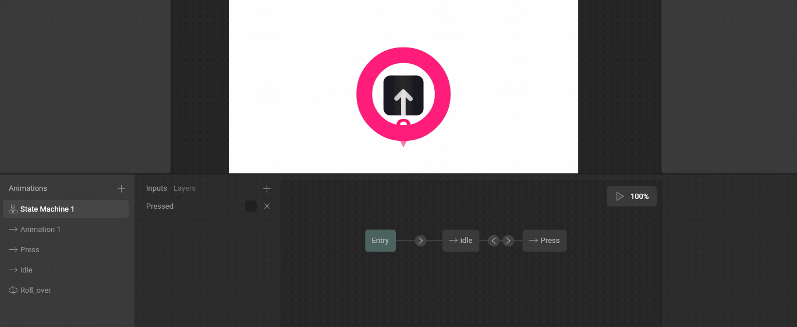

## Blend States

A Blend State allows you to mix animations together on the same state. You can use this to create all kinds of interesting interactions, like pull-to-refresh animations, creative loading bars, facial expressions, or to control the walk/run speed of a character.

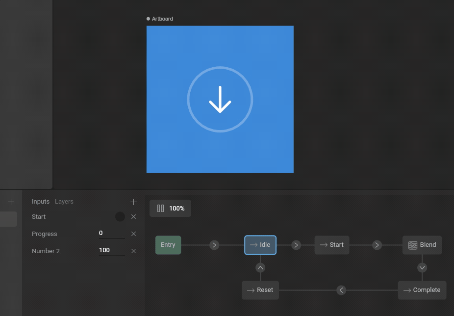

To make a Blend State, select a state and use the toggle to change the type. Rive currently supports three types of state:

* Animation State
* 1D Blend State
* Additive Blend State

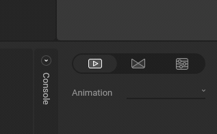

### 1D Blend State

A 1D Blend State allows you to blend animations using a number input. After choosing the blend type, you'll want to pick which input will control this blend state.

Then add animations with the plus button and set the threshold for each. The thresholds for each animation determine the range of your Blend State. In our example, the range is from 0 to 100. That means that one animation is playing fully at each end of the range, while anything in between is a blend of both animations. You can see this represented in the diagram above the animations list. As you change the input value, watch to see how the position in this range changes the mix amount of each animation.

### Additive Blend State

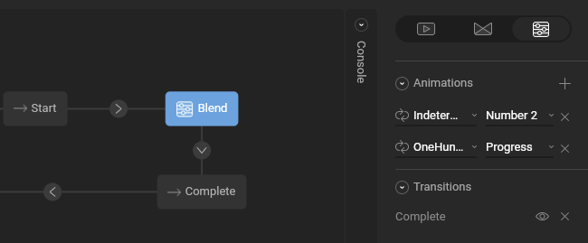

An Additive Blend State allows you to map any input directly to any animation. The Additive Blend State expects a number between 0-100 \(which defines whether 0% of the animation is playing or if 100% of the animation is playing\). This can be useful if you want to have exact control over animations, rather than blending them indirectly with a single input.

## Layers

A state machine layer can have only one active state at a time. Add in additional layers to your state machine to play multiple states simultaneously.

