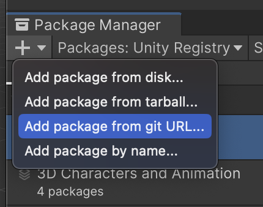

# Getting Started


The rive-unity package is currently in **Technical** **Preview** for macOS and Windows. We're hoping to gather feedback about the API and feature-set as we expand platform support. There may be sudden breaking changes between versions and not all Rive runtime features are supported yet - see [#feature-support](./#feature-support "mention")


## Example Projects

To quickly experiment with rive-unity, run one of our example projects: [https://github.com/rive-app/rive-unity-examples](https://github.com/rive-app/rive-unity-examples)

## Installation

The [rive-unity package](https://github.com/rive-app/rive-unity) is available to install from GitHub.

You will need a Unity editor that supports OpenGL or D3D11 for Windows, or a Mac with ARM64 (M1, M2, etc) architecture.

On Mac with ARM64 you do not need to configure anything. To manually update select either D3D11/OpenGL for Windows, or Metal for Mac/iOS as the Graphics API under **Edit ->** **Project** **Settings -> Player** in Unity.

You can install the Rive package for Unity by opening the Package Manager and adding the [latest tag](https://github.com/rive-app/rive-unity/tags) as a git dependency:

```
git@github.com:rive-app/rive-unity.git?path=package#v0.1.30
```

Or through HTTP:

```
https://github.com/rive-app/rive-unity.git?path=package#v0.1.30
```

1. Open **Window -> Package Manager**
2. Choose **Add package from git URL...**
3. Add the URL with version tag

<figure><figcaption><p>Add rive-unity package</p></figcaption></figure>

You can also add and update it manually to your projects `Packages/manifest.json` file:

```json
"app.rive.rive-unity": "git@github.com:rive-app/rive-unity.git?path=package#v0.1.30",
```

## Assets

A `.riv` file can be added like any other Unity asset, by dragging it into the `Assets` folder. You can preview the animation in the inspector by selecting it.

<figure><figcaption><p>.riv asset preview in Unity</p></figcaption></figure>

## File

A `Rive.File` contains Artboards, StateMachines, and Animations. There are higher-level behaviors that you can use directly in the Unity editor. Use this class if you need direct control of the lifecycle of the Rive File.

A Rive File can be created from a Rive Asset (.riv):

```csharp
public Rive.Asset asset; // pass in .riv asset in the inspector
private Rive.File m_file;

...

private void Start()
{
    if (asset != null)
    {
        m_file = Rive.File.load(asset);
    }
}
```

## Arboards

An [Artboard](../../editor/fundamentals/artboards.md) contains [StateMachines](../../editor/state-machine/) and Animations. Artboards are instantiated from a `Rive.File` instance:

<pre class="language-csharp"><code class="lang-csharp">private Artboard m_artboard;

...
<strong>
</strong><strong>m_artboard = m_file.artboard(0); // by index
</strong>m_artboard = m_file.artboard("Arboard 1"); // by name
</code></pre>

## State Machines

A StateMachine contains Inputs and Events, for more information see Unity [State Machines](state-machines.md) and [Events](rive-events.md).

State Machines are instantiated from an Arboard instance:

```csharp
private StateMachine m_stateMachine;

...

m_stateMachine = m_artboard?.stateMachine(); // default state machine
m_stateMachine = m_artboard?.stateMachine(0); // state machine at index
m_stateMachine = m_artboard?.stateMachine("Name"); // state machine with name
```

They also control advancing (playing) an animation:

<pre class="language-csharp"><code class="lang-csharp">private void Update()
{
<strong>    m_stateMachine?.advance(Time.deltaTime);
</strong><strong>}
</strong></code></pre>

## Rendering

Rive Unity renders to a [RenderTexture](https://docs.unity3d.com/ScriptReference/RenderTexture.html) that you can display in your Scene by attaching to a [Material](https://docs.unity3d.com/ScriptReference/Material.html) or drawing to the camera. Layout and draw commands are managed through the `RenderQueue`.

For a more complex example drawing a texture directly to a camera, see the **getting-started** project in the [examples repository](https://github.com/rive-app/rive-unity-examples).

The following is a basic example script behaviour to render a given Rive `asset` to the provided `renderTexture`. The animation is played by calling `advance` on the State Machine.

See [Animation Playback](../../runtimes/playback.md) for more general information on playing animations and state machines at runtime.


```csharp
using System.Collections;
using UnityEngine;
using UnityEngine.Rendering;
using UnityEditor;

using LoadAction = UnityEngine.Rendering.RenderBufferLoadAction;
using StoreAction = UnityEngine.Rendering.RenderBufferStoreAction;

namespace Rive
{
    public class RiveTexture : MonoBehaviour
    {
        public Rive.Asset asset;
        public RenderTexture renderTexture;
        public Fit fit = Fit.contain;
        public Alignment alignment = Alignment.center;

        private RenderQueue m_renderQueue;
        private CommandBuffer m_commandBuffer;

        private Rive.File m_file;
        private Artboard m_artboard;
        private StateMachine m_stateMachine;

        private Camera m_camera;

        private void Start()
        {
            m_renderQueue = new RenderQueue(renderTexture);
            if (asset != null)
            {
                m_file = Rive.File.load(asset);
                m_artboard = m_file.artboard(0);
                m_stateMachine = m_artboard?.stateMachine();
            }

            if (m_artboard != null && renderTexture != null)
            {
                m_renderQueue.align(fit, alignment, m_artboard);
                m_renderQueue.draw(m_artboard);

                m_commandBuffer = new CommandBuffer();
                m_renderQueue.toCommandBuffer();
                m_commandBuffer.SetRenderTarget(renderTexture);
                m_commandBuffer.ClearRenderTarget(true, true, UnityEngine.Color.clear, 0.0f);
                m_renderQueue.addToCommandBuffer(m_commandBuffer);
                m_camera = Camera.main;
                if (m_camera != null)
                {
                    Camera.main.AddCommandBuffer(CameraEvent.AfterEverything, m_commandBuffer);
                }
            }
        }

        private void Update()
        {
            if (m_stateMachine != null)
            {
                m_stateMachine.advance(Time.deltaTime);
            }
        }

        private void OnDisable()
        {
            if (m_camera != null && m_commandBuffer != null)
            {
                m_camera.RemoveCommandBuffer(CameraEvent.AfterEverything, m_commandBuffer);
            }
        }
    }
}
```


1. Create a Unity [RenderTexture](https://docs.unity.cn/ru/2020.1/Manual/class-RenderTexture.html) and [Material](https://docs.unity3d.com/2019.3/Documentation/Manual/Materials.html) in Assets
2. Assign the **RenderTexture** to the **Material**
3. Drag this behaviour to a **GameObject** and attach the material
4. Link the .riv asset and **RenderTexture** on the **RiveTexture** (custom script) behaviour

<figure><figcaption><p><code>RiveTexture</code> in Unity Inspector</p></figcaption></figure>
