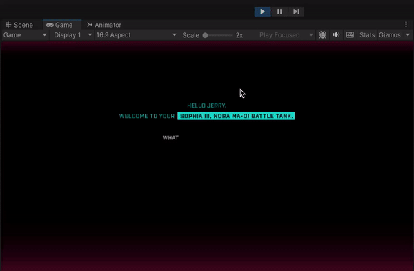

# Listeners


This article is out of date! Find the [new version here](https://rive.app/community/doc/listeners/docRlEVvrCZW).


For more information on Rive Listeners see the [editor documentation](../../editor/state-machine/listeners.md).

## Pointer Positions

In rive-unity pointer (mouse/touch) events can be passed to an artboard to enable Rive Listeners. This is accomplished by translating the pointer position to an artboard's local coordinate.

For a complete example see the **getting-started** project in the [examples repository](https://github.com/rive-app/rive-unity-examples) and open a sample scenes:&#x20;

* **DrawToCameraScene**: Pointer events on a camera
* **DrawToCubeScene**: Pointer events on a mesh

#### Camera Hit Test

See the **DrawToCameraScene** scene in the **getting-started** project from the [example repository](https://github.com/rive-app/rive-unity-examples).

<figure><figcaption><p>Unity Rive camera hit testing</p></figcaption></figure>

This code snippet demonstrates translating mouse position on the camera to an artboard.

```csharp
private Artboard m_artboard;
private StateMachine m_stateMachine;

...

Camera camera = gameObject.GetComponent<Camera>();
if (camera != null)
{
    Vector3 mousePos = camera.ScreenToViewportPoint(Input.mousePosition);
    Vector2 mouseRiveScreenPos = new Vector2(
        mousePos.x * camera.pixelWidth,
        (1 - mousePos.y) * camera.pixelHeight
    );
    if (m_artboard != null && m_lastMousePosition != mouseRiveScreenPos)
    {
        Vector2 local = m_artboard.LocalCoordinate(
            mouseRiveScreenPos,
            new Rect(0, 0, camera.pixelWidth, camera.pixelHeight),
            fit,
            alignment
        );
        m_stateMachine?.PointerMove(local);
        m_lastMousePosition = mouseRiveScreenPos;
    }
    if (Input.GetMouseButtonDown(0))
    {
        Vector2 local = m_artboard.LocalCoordinate(
            mouseRiveScreenPos,
            new Rect(0, 0, camera.pixelWidth, camera.pixelHeight),
            fit,
            alignment
        );
        m_stateMachine?.PointerDown(local);
        m_wasMouseDown = true;
    }
    else if (m_wasMouseDown)
    {
        m_wasMouseDown = false;
        Vector2 local = m_artboard.LocalCoordinate(
            mouseRiveScreenPos,
            new Rect(0, 0, camera.pixelWidth, camera.pixelHeight),
            fit,
            alignment
        );
        m_stateMachine?.PointerUp(local);
    }
}
```

#### Mesh Hit Test

See the **DrawToCubeScene** scene in the **getting-started** project from the [example repository](https://github.com/rive-app/rive-unity-examples).

<figure><figcaption><p>Unity Rive mesh hit testing</p></figcaption></figure>

This code snippet demonstrates translating a [RaycastHit](https://docs.unity3d.com/ScriptReference/RaycastHit.html) on an object to an artboard's local coordinates.


The **GameObject** must have a **MeshCollider** attached.


```csharp
void HitTesting()
{
    Camera camera = Camera.main;

    if (camera == null || renderTexture == null || m_artboard == null) return;

    if (!Physics.Raycast(camera.ScreenPointToRay(Input.mousePosition), out RaycastHit hit))
        return;

    Renderer rend = hit.transform.GetComponent<Renderer>();
    MeshCollider meshCollider = hit.collider as MeshCollider;

    if (rend == null || rend.sharedMaterial == null || rend.sharedMaterial.mainTexture == null || meshCollider == null)
        return;

    Vector2 pixelUV = hit.textureCoord;

    pixelUV.x *= renderTexture.width;
    pixelUV.y *= renderTexture.height;

    Vector3 mousePos = camera.ScreenToViewportPoint(Input.mousePosition);
    Vector2 mouseRiveScreenPos = new(mousePos.x * camera.pixelWidth, (1 - mousePos.y) * camera.pixelHeight);

    if (m_lastMousePosition != mouseRiveScreenPos || transform.hasChanged)
    {
        Vector2 local = m_artboard.LocalCoordinate(pixelUV, new Rect(0, 0, renderTexture.width, renderTexture.height), fit, alignment);
        m_stateMachine?.PointerMove(local);
        m_lastMousePosition = mouseRiveScreenPos;
    }
    if (Input.GetMouseButtonDown(0))
    {
        Vector2 local = m_artboard.LocalCoordinate(pixelUV, new Rect(0, 0, renderTexture.width, renderTexture.height), fit, alignment);
        m_stateMachine?.PointerDown(local);
        m_wasMouseDown = true;
    }
    else if (m_wasMouseDown)
    {
        m_wasMouseDown = false; Vector2 local = m_artboard.LocalCoordinate(mouseRiveScreenPos, new Rect(0, 0, renderTexture.width, renderTexture.height), fit, alignment);
        m_stateMachine?.PointerUp(local);
    }
}
```
