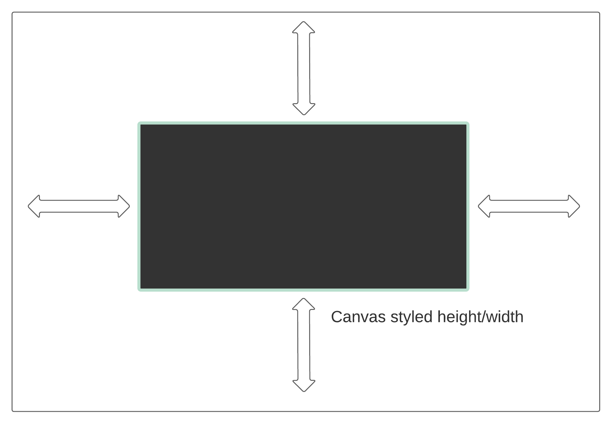
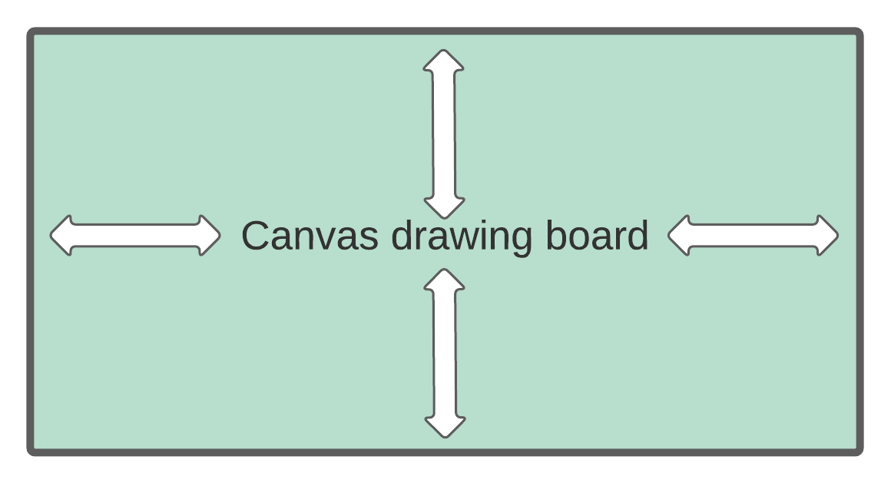

# FAQ

## Concerns

We've compiled a list of common concerns when using web-based runtimes. See each section below for more on how to address these in your applications.

### Why am I getting CORS errors fetching Rive files?

In some cases, you may decide to host your `.riv` files over a CDN, and store them in AWS S3 for example. At runtime, some users face CORS issues where you may not be able to load in the `.riv` file in the web runtime. When this happens, make sure to set CORS headers on the host platform such that when the Rive file content is accessed in the web apps/sites, browsers won't block pulling data down.\
\
Read more on [what CORS](https://developer.mozilla.org/en-US/docs/Web/HTTP/CORS) is.\
[See here](https://docs.aws.amazon.com/AmazonS3/latest/userguide/ManageCorsUsing.html#cors-example-1) for more docs on how to configure CORS in AWS S3, as an example.

### Why did the canvas width/height attribute values change?

You may have noticed that the `<canvas>` width/height attributes in the DOM may be larger than you originally set by some factor. Internally, the high-level API tries to adjust the original set (or default) canvas width/height attributes by accounting for the `window.devicePixelRatio`. By doing this internal calculation, we're able to account for high-dpi screens so that Rive animations don't have a "blurry" output. We do not however try to size the actual size of the canvas element with respect to the DOM. This is ultimately up to you to configure.

### Why is my animation blurry at runtime?

It may be because there are no width/height attributes on the `<canvas>` element to determine the drawing size of the canvas, or the default values are not large enough to meet the artboard bounds of the animation. We recommend setting at least some CSS style width/height properties on the canvas to determine the size of the canvas box on the page, as the runtime will then use those values to try and set a best-fit estimate of the drawing size to the canvas element.

Additionally, you could take advantage of a public function `resizeDrawingSurfaceToCanvas` on the `Rive` object when instantiated that helps adjust the width/height attributes of the canvas in the DOM based on the user's `devicePixelRatio`. (**note**: this applies to the drawing surface of the canvas, not the size of the bounding box of the canvas element).

```html
<canvas
    id="some-canvas-element-id"
    style="width: 400px; height: 400px;"
></canvas>
```

```javascript
const canvasElement = document.getElementById('some-canvas-element-id');

const r = new Rive({
  src: 'some-file.riv',
  canvas: canvasElement,
  autoplay: true,
  onLoad: () => {
    r.resizeDrawingSurfaceToCanvas();
  },
});
```


If you use the `resizeDrawingSurfaceToCanvas` function, make sure you bound your canvas actual style size to desired values, otherwise the canvas could double in size.&#x20;


### What's the difference in width/height attributes on the canvas and the CSS width/height?

Great question! With the `<canvas>` element, there are 2 types of space sizes to think about.

There's the size of the canvas element itself on the page, which is usually what most people think of when setting width/height styles on an element. This involves setting the CSS width/height properties on an element.

```
<canvas style="width: 400px; height: 400px;"></canvas>
```



Then there are the width/height attributes on a `<canvas>` element that determines the drawing surface size of the canvas. In some cases, these values may influence the actual canvas size as well if there are no CSS styles set on the width/height of the element. But mainly, these width/height attributes help determine how much space is available to draw within the canvas element itself. Unlike the CSS width/height properties, these values are unitless.

```
<canvas width="800" height="800"></canvas>
```



Ideally, you want to ensure that the width/height attributes on the canvas are at least the size of or greater than the width/height CSS properties on the canvas, otherwise, you may have blurry output (see above for how to address blurry animations).

### How come my state machine isn't playing?

Make sure you've specified the `stateMachines` property when instantiating Rive with the name of your state machine. To autoplay the state machine, don't forget to set `autoplay: true` when instantiating the Rive object.

### How do I get other web-frameworks to support Rive?

Currently, we support the React runtime officially, beyond the plain JS/TS runtime here. There have been community-driven wrappers created to support other web-based libraries/frameworks, such as Angular. We recommend checking out the [rive-react](https://github.com/rive-app/rive-react) source project to understand how it wraps this JS runtime into React-friendly components and hooks to make using Rive better in React-based applications. We encourage you to explore doing the same for any other web-based framework/library you may be interested in building Rive with!
